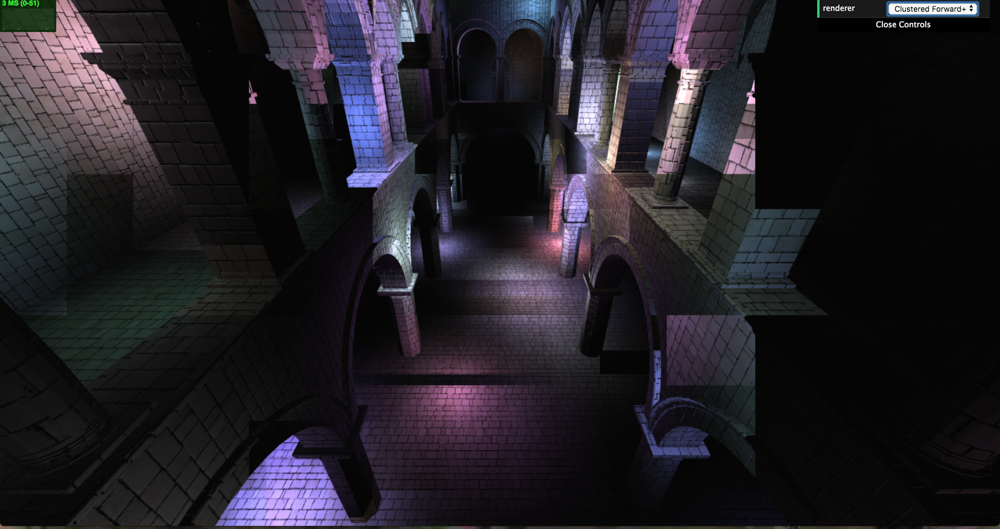

WebGL Clustered Deferred and Forward+ Shading
======================

**University of Pennsylvania, CIS 565: GPU Programming and Architecture, Project 5**

* Wenli Zhao
* Tested on: **Google Chrome**
  Mac OS X El Capitan 10.11.6 , 2.6 GHz Intel Core i5, Intel Iris 1536 MB

### Live Online

Coming soon. I will put this online when I work out some bugs!

### Demo Video/GIF

Also coming soon. In the meantime, here is an image of a slightly buggy clustered forward+ renderer:

### ReadMe
The goal of this project was to implement a clustered forward + and clustered deferred renderer.

Clustered forward+ is a rendering technique that divides the scene visible to the camera into "clusters". Imagine chopping up the camera frustum into smaller pieces. When rendering the scene, rather than checking against all the lights, we only check against the lights influencing the cluster that the geometry is in. This leads to huge performance gains when there are lots of lights in the scene.

Clustered deferred shading also uses the same cluster technique, but uses two passes for shading. In this implementation, it goes through two fragment shaders. The first stores relevant information about the fragment in a g-buffer, which is actually just a texture. The second shader reads from the g-buffer and uses the attributes to actually calculate the light and shading. 

I implemented both the clustered forward+ and the clustered deferred renderer with blinn phong shading. However, I was not able to properly debug the clustered forward+, which is why the images of tile-outlines. Additionally, after adding the blinn-phong shading to the clustered deferred, it stopped working. So to demonstrate that I properly implemented the shading, I included a screenshot of the blinn-phong shading applied to clustered forward+, even though it doesn't look that pretty.

### Analysis

After 500 lights, the normal forward rendering stopped running on my machine. Unfortunately, I wasn't able to work out some bugs in my cluster deferred renderer so I couldn't do a thorough analysis on it. Furthermore, the numbers I measured were not extremely accurate. I got a different measurement everytime I ran the program even for the same number of lights.

Overall, the clustered forward+ was a huge optimization over regular forward rendering. It could still run on my machine at 10,000 lights, whereas forward froze my browser. For smaller numbers of lights, the performance gain was smaller. Naively running through all the lights in the scene is not as costly. Additionally there is a lot of overhead in computing the clusters and the light indexing itself. However, it pays off greatly as the number of lights in the scene increases. 

### Debug views

I could render the normals, uvs, and depth of the cluster deferred renderer, but it not render the correct shading. I think something is wrong with the light sampling, but I still need to debug it!

### Credits

* [Three.js](https://github.com/mrdoob/three.js) by [@mrdoob](https://github.com/mrdoob) and contributors
* [stats.js](https://github.com/mrdoob/stats.js) by [@mrdoob](https://github.com/mrdoob) and contributors
* [webgl-debug](https://github.com/KhronosGroup/WebGLDeveloperTools) by Khronos Group Inc.
* [glMatrix](https://github.com/toji/gl-matrix) by [@toji](https://github.com/toji) and contributors
* [minimal-gltf-loader](https://github.com/shrekshao/minimal-gltf-loader) by [@shrekshao](https://github.com/shrekshao)
