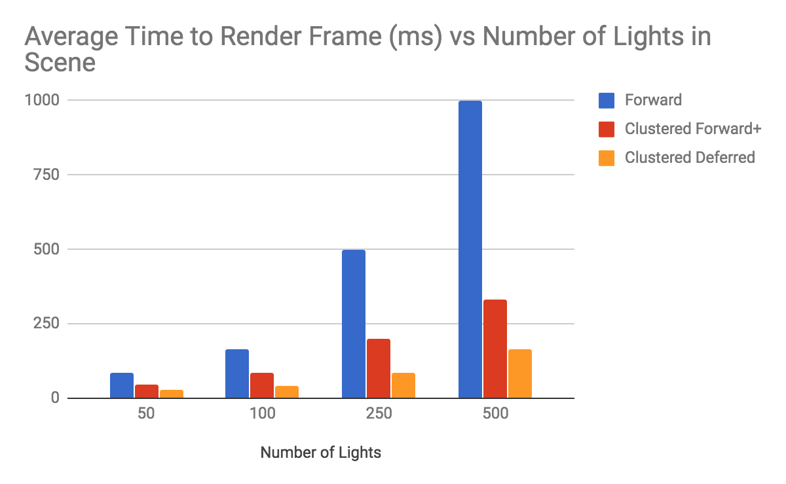
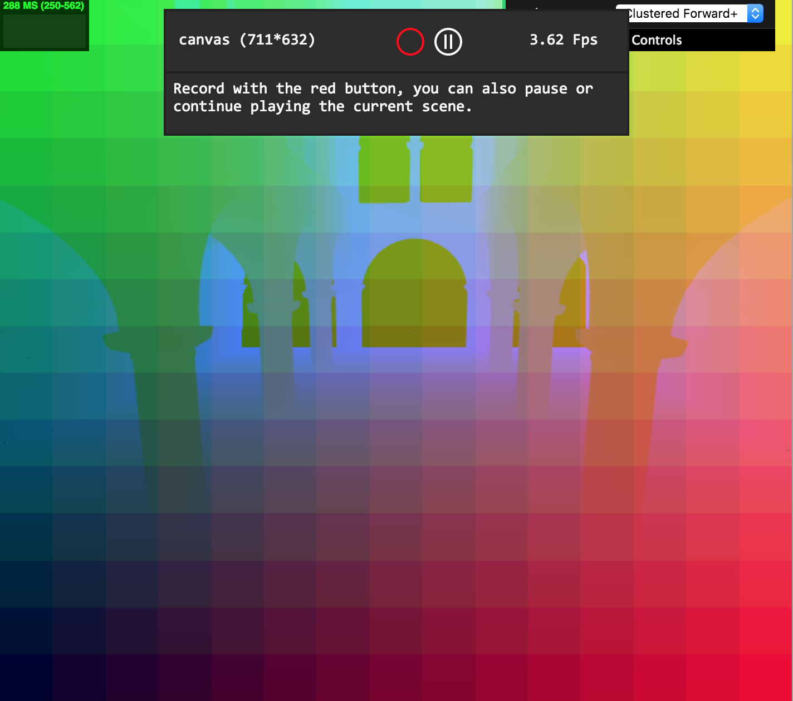
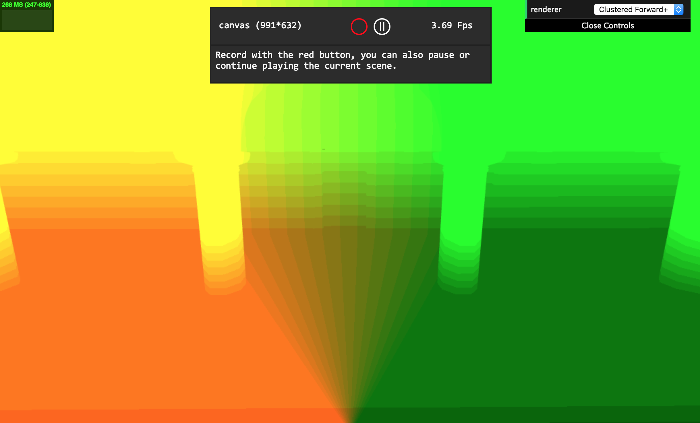
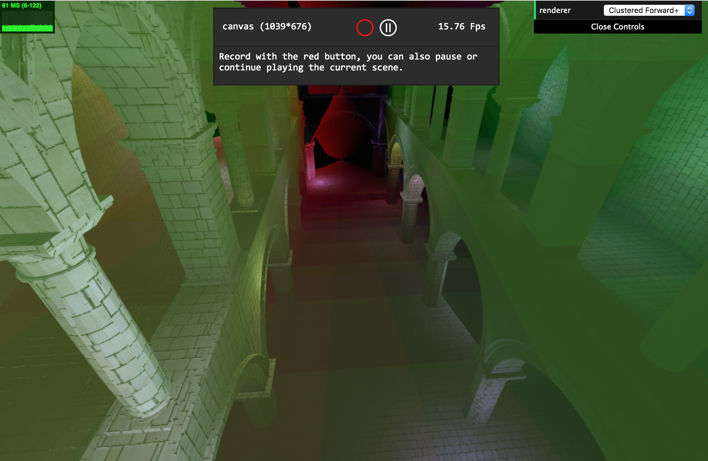

WebGL Clustered Deferred and Forward+ Shading
======================

**University of Pennsylvania, CIS 565: GPU Programming and Architecture, Project 5**

* William Ho
* Tested on: **Google Chrome** on 
  OS X El Capitan, MacBook Pro 2013, 2.4, GHz Intel Core i5, Intel Iris 1536 MB
### Live Online

### Overview

This project consists of implementations of a **Clustered Forward+** renderer and a **Clustered Deferred** renderer, compared against a general case **Forward** renderer. 

A forward renderer performs brute force lighting by shading fragments against every possible light in the scene. The unnecessary work is in the negligible effects a given light has on the majority of fragments. A solution to this is to divide our rendered area up into "clusters", where the fragments in a given cluster need only be shaded for the lights that affect that specific cluster. This involves a CPU side preprocessing of light information to map clusters to their relevant lights. This is what **Clustered Forward+** performs.

To further decrease the amount of unnecessary work done, a further solution is to defer lighting to a second stage after fragment attributes have been computed. On a first pass, the scene is processed and attributes are passed to a g-buffer, which is then passed to a second pass render (in which we can again use our clustering technique). We are able to leverage the fact that the first render pass discards all unnecessary fragments (such as those occluded). This is what **Clustered Deferred** performs.

### Comparisons of Implementation

| Forward Renderer | Clustered Forward+ | Clustered Deferred  (w/ Blinn-Phong)|
|:----:|:----:|:----:|
|  |  |  |

### Analysis

We can see here that as we increase the number of lights in the scene, our Clustered implementations are able to render at a higher frame rate than the basic Forward implementation, and our Deferred shader grants us extra wins on time.  Our Clustered Forward+ manages to eliminate the unnecessary lighting work by culling redundant lights from fragments. The Deferred renderer culls unnecessary fragments from being shaded. 

It should be noted that utilizing the clustering technique has other costs. Clustering the scene must be done before the scene is processed by the vertex and fragment shaders, and this CPU-side preprocessing step can have potential downsides. If for, instance, clustering did not effectively cull lights, such as in a case where relevant lights span all clusters, clustering could prove detrimental. There is also the added overhead of generating clustering data. 

Deferred shading similarly has an extra step that effectively culls unnecessary fragments, but in cases where such fragments are not as common, such as scenes with little occlusion, it could be ineffective. Additionally, deferred shading requires the ability to specify multiple render targets, which is not supported in all cases. The other drawback to deferred shading is the increased bandwidth requirements of passing the g-buffer from one render pass to the next.

## Potential Improvements

There are several improvements to these implementations that are worth exploring:

* Improved cluster testing: my implementation currently calculates a conservative bounding frustrum per light to calculate its relevant clusters. It is possible that clusters could be more effectively culled from the light.

* Optimized g-buffer: better packing of data in the g-buffer reduces bandwidth requirements.

### Debug Views

Debugging view of clustering in screen space. 

Debugging view to illustrate cluster plane calculation.

Debugging view of frozen clustering frustrum to visualize fragment cluster placement. 

### Credits

* [Three.js](https://github.com/mrdoob/three.js) by [@mrdoob](https://github.com/mrdoob) and contributors
* [stats.js](https://github.com/mrdoob/stats.js) by [@mrdoob](https://github.com/mrdoob) and contributors
* [webgl-debug](https://github.com/KhronosGroup/WebGLDeveloperTools) by Khronos Group Inc.
* [glMatrix](https://github.com/toji/gl-matrix) by [@toji](https://github.com/toji) and contributors
* [minimal-gltf-loader](https://github.com/shrekshao/minimal-gltf-loader) by [@shrekshao](https://github.com/shrekshao)
* [Practical Clustered Shading](http://www.humus.name/Articles/PracticalClusteredShading.pdf) by Emil Persson, Head of Research, Avalanche Studios
