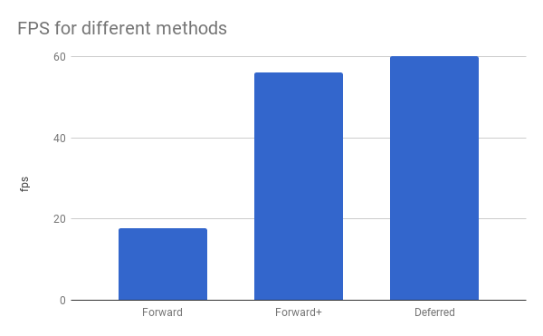
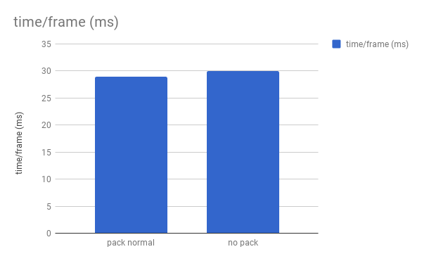

WebGL Clustered Deferred and Forward+ Shading
======================

**University of Pennsylvania, CIS 565: GPU Programming and Architecture, Project 5**

* Yalun Hu
* Tested on: **Google Chrome 222.2** on
  Windows 10, i7-6700HQ CPU @ 2.60GHz 32GB, GTX 1070 8192MB (Personal computer)

### Live Online

### Demo Video/GIF

# Features

## 1. Clustered Forward+
* Build a data structure to keep track of how many lights are in each cluster and what their indices are.
* Render the scene using only the lights that overlap a given cluster.

  

Parameters:
MAX_LIGHTS_PER_CLUSTER = 1000;
NUM_LIGHTS = 500;
LIGHT_RADIUS = 3.0;

## 2. Clustered Deferred

* Reuse clustering logic from Clustered Forward+.
* Store vertex attributes in g-buffer.
* Read g-buffer in a shader to produce final output

  

Parameters:
MAX_LIGHTS_PER_CLUSTER = 1000;
NUM_LIGHTS = 500;
LIGHT_RADIUS = 3.0;

## 3. Effects

* Implement deferred Blinn-Phong shading (diffuse + specular) for point lights

## 4. Optimizations

* Optimized g-buffer format - reduce the number and size of g-buffers:
    * Encode normals from vec3 to vec2, and decode in deferred fragment shader.
    * Use only 2 G-buffers instead of four.
    * But encoding the normal leads to some information loss.

# Performance Analysis

## 1. Forward vs. Forward+ vs. Deferred

  

Parameters:
MAX_LIGHTS_PER_CLUSTER = 1000;
NUM_LIGHTS = 500;
LIGHT_RADIUS = 3.0;

It shows that Forward+ and Deferred really improve the performance. And Deferred works a little bit better than Forward+.

## 2. Pack normal vs. no pack

  

Parameters:
MAX_LIGHTS_PER_CLUSTER = 1000;
NUM_LIGHTS = 1500;
LIGHT_RADIUS = 3.0;

Theoratically, packing normals uses less resources and improve the overall performance obviously. Considering the hardware and the range of the input data, the influence of this optimization is limited.

### Credits

* [Three.js](https://github.com/mrdoob/three.js) by [@mrdoob](https://github.com/mrdoob) and contributors
* [stats.js](https://github.com/mrdoob/stats.js) by [@mrdoob](https://github.com/mrdoob) and contributors
* [webgl-debug](https://github.com/KhronosGroup/WebGLDeveloperTools) by Khronos Group Inc.
* [glMatrix](https://github.com/toji/gl-matrix) by [@toji](https://github.com/toji) and contributors
* [minimal-gltf-loader](https://github.com/shrekshao/minimal-gltf-loader) by [@shrekshao](https://github.com/shrekshao)
* [Encode normals](https://aras-p.info/texts/CompactNormalStorage.html#method03spherical) by [Aras Pranckevičius](https://aras-p.info/)
