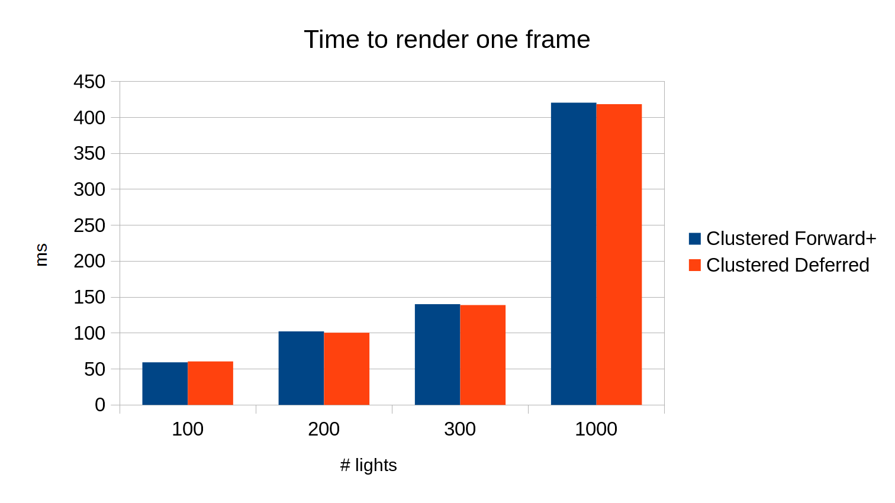
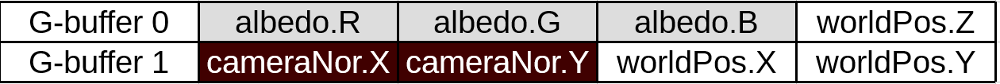
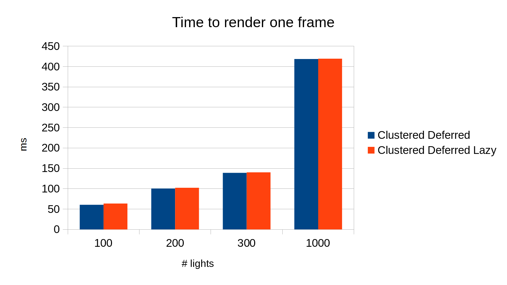
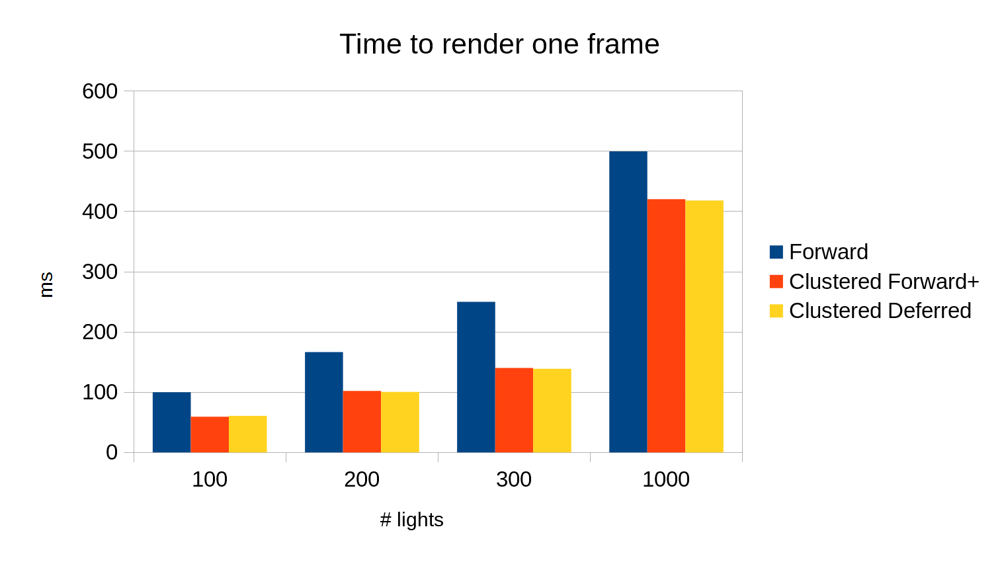
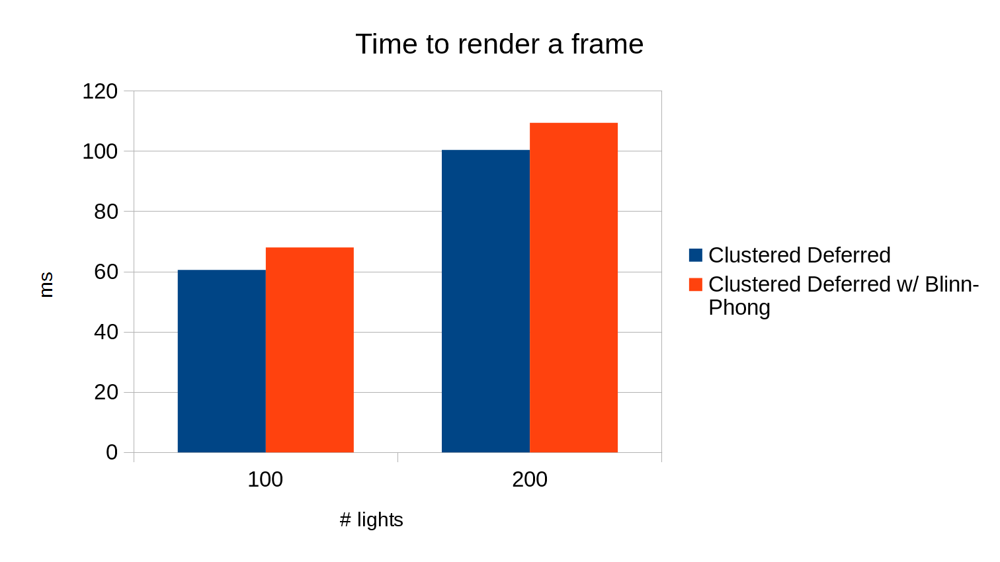
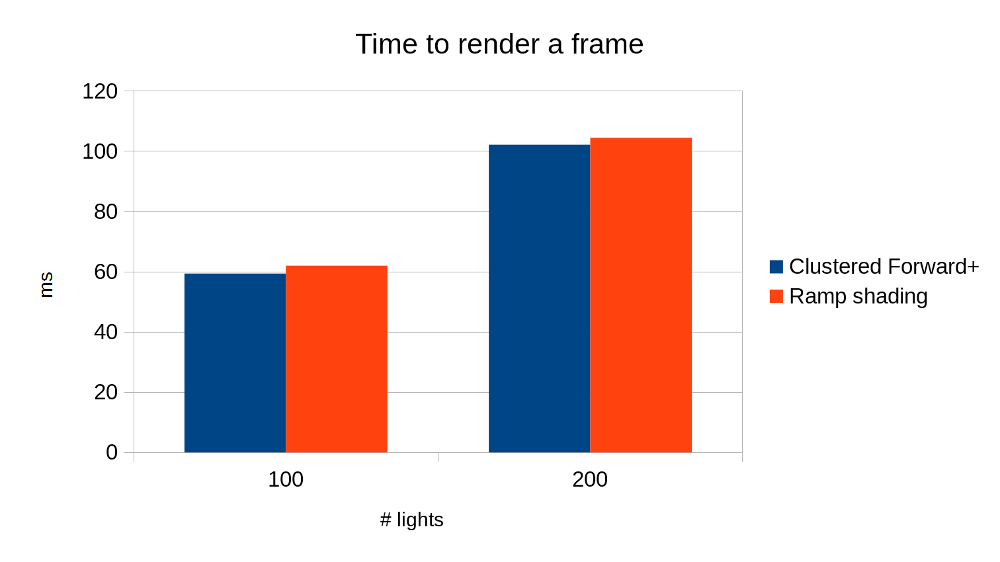
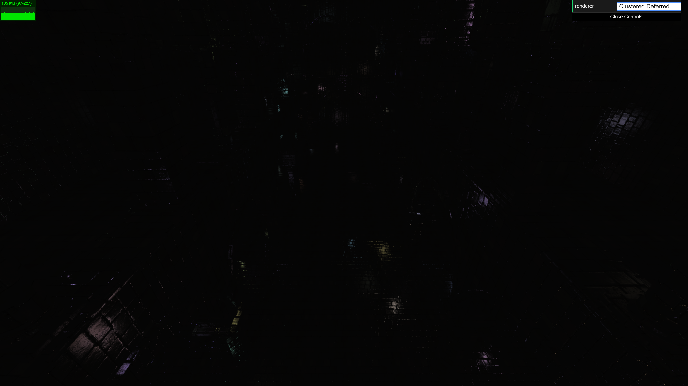

WebGL Clustered Deferred and Forward+ Shading
======================

**University of Pennsylvania, CIS 565: GPU Programming and Architecture, Project 5**

* Mauricio Mutai
* Tested on: **Version 61.0.3163.100 (Official Build) (64-bit)** on
  Windows 10, i7-7700HQ @ 2.2280GHz 16GB, GTX 1050Ti 4GB (Personal Computer)

### Live Online

### Demo Video/GIF

Ramp shading enabled, 100 lights

### Overview

The aim of this project was to implement two different rendering pipelines. Both take advantage of clustered rendering, which, in simple terms, is an optimization in which we determine which lights can affect which parts of our frustum. This allows us to cull lights when shading fragments.

One pipeline is called Clustered Forward+. It takes the basic forward rendering pipeline and applies clustering.

The other pipeline is called Clustered Deferred pipeline. In this pipeline, we *defer* the shading until after we have determined which pieces of geometry will be rendered.

### Features

#### Clustered Forward+

* Keeps track of which lights overlap each subsection of the frustum (cluster)

* Uses exponential partitioning in Z axis for more useful partitioning

* Renders each fragment using only lights that overlap the fragment's cluster

#### Clustered Deferred

* Stores vertex attributes using two g-buffers

* Reads g-buffers and cluster buffer (same as in Clustered Forward+) to render final fragments

### Performance

#### Preface

I would like to preface this performance analysis by mentioning that there is a possibility the results below are influenced by some sort of bug with Chrome/Node.JS/etc. The timing mechanisms I used (`Date.now()` and `Stats.js`) both tell me the Forward pipeline renders all frames with only 0 or 1 ms of delay, which is clearly absurd. It also only registers 10 FPS upon switching to FPS mode, which is incompatible with a 1 ms delay (we would expect 1000 FPS instead). Restarting Chrome and my computer did not help. In summary, I think my measurements may not be correct, but I had no means of fixing this, and received no help after asking the mailing list (it might be a computer-specific problem).

#### Clustered Forward+ vs Clustered Deferred

I got roughly the same performance for both clustered forward+ and clustered deferred. The graph below shows this:

The deferred pipeline is slightly faster, but in practice, both have the same performance even as the number of lights increases. Normally, one would expect the deferred pipeline to handle more lights better, since it spends less time shading fragments with each light -- it only shades the final fragments that need to be shaded, whereas the forward+ pipeline will shade all fragments, even those that won't be rendered. This means the forward+ pipeline should slow down more as lights are added, when compared to the deferred pipeline.

So it is unusual that both have the same performance. I have three hypotheses for this behavior.

* The clustering optimization is bottlenecking both implementations equally. This is definitely possible, due to the large number of memory accesses required by this optimization.

* The deferred pipeline saves time due to its deferred nature (explained above), but is slowed down by the extra work it has to do, such as performing an additional pass to write to the g-buffer and reading from the g-buffer.

* As mentioned in the preface, my measurements might just be incorrect due to some hardware/software fault out of my control.

In general terms, the benefit of using the deferred pipeline would be its better performance in scenes with a high number of lights. However, there is one tradeoff: the additional memory needed for the g-buffer. An environment with a memory-starved GPU may not be able to run a deferred pipeline.

#### G-buffer optimization

Below is how my g-buffers are organized. I use two in total.

In summary, values are packed into vec4s, and 2-component normals are used.

The normals are converted to camera space to make the Z coordinate redundant -- we can compute its absolute value from X and Y, since we know the normal's length is 1. We also know the normal in camera space has Z > 0, otherwise the geometry would not be visible.

Below is a performance comparison between the final clustered deferred pipeline and its "lazy" version, which uses 3 g-buffers instead.

As we can see, there is a roughly constant and small improvement (of about 2 ms) to using 2 g-buffers instead of 3. This is probably due to not needing to copy the data of the 3rd g-buffer, as well as not needing to read a 3rd g-buffer value (which is essentially reading a pixel from a texture). There is an additional computational cost to using two g-buffers, such as computing the world space normal from the two camera space normal coordinates. This additional cost probably prevents the g-buffer optimization from being too effective.

#### Clustered vs. Plain Forward

Below is a graph comparing both clustered pipelines to the original, plain forward pipeline:

As we can see, the clustering optimization definitely improves performance. This makes sense, since fewer lights have to be checked for each piece of geometry that is shaded.

### Additional Effects

#### Blinn-Phong

Blinn-Phong lighting is enabled by default on the clustered deferred pipeline (the measurements above were taken without it enabled). This has the effect of making surfaces look "shiny" or specular when light hits them in a specific direction relative to the camera. My implementation is based off Penn's CIS 460 slides.

Below is a GIF of it in action:

Below is a comparison of runtime with Blinn-Phong enabled vs. disabled:

As we can see, there is a small hit to performance due to the additional computation that must be performed for Blinn-Phong. I suspect the call to `pow()` is contributing a fair amount to this.

#### Ramp shading

This is a simple technique where we limit our Lambert shading factor to a discrete set of values, making our image look more cartoon-ish. I did the same to the Gaussian component to improve this effect.

The effect can be seen in the "Demo GIF" at the top of this README. It is disabled by default -- it can be enabled in `clusteredForward.frag.glsl.js`.

Below is a graph comparing the runtime with ramp shading enabled vs. disabled:

As we can see, it impacts our performance, but not significantly.

### Debug Views

Clustering along X:

Clustering along Y:

Clustering along Z:

Absolute values of normals (absolute values taken in order to show normals with negative X coordinates):

Specular contribution only (Blinn-Phong):

### Credits

* [Three.js](https://github.com/mrdoob/three.js) by [@mrdoob](https://github.com/mrdoob) and contributors
* [stats.js](https://github.com/mrdoob/stats.js) by [@mrdoob](https://github.com/mrdoob) and contributors
* [webgl-debug](https://github.com/KhronosGroup/WebGLDeveloperTools) by Khronos Group Inc.
* [glMatrix](https://github.com/toji/gl-matrix) by [@toji](https://github.com/toji) and contributors
* [minimal-gltf-loader](https://github.com/shrekshao/minimal-gltf-loader) by [@shrekshao](https://github.com/shrekshao)
