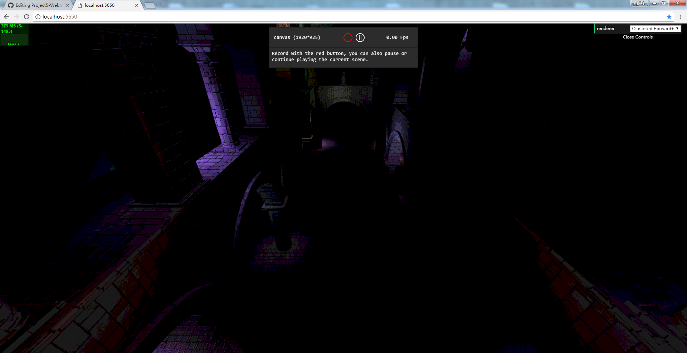
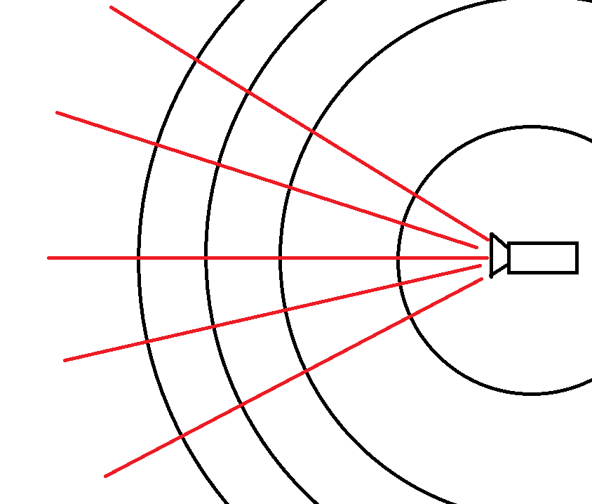

WebGL Clustered Deferred and Forward+ Shading
======================

**University of Pennsylvania, CIS 565: GPU Programming and Architecture, Project 5**

* JuYang
* ### Tested on: Windows 7, i7-4710MQ @ 2.50GHz 8GB, GTX 870M 6870MB (Hasee Notebook K770E-i7)

Well after almost 2 weeks, I decided to give up on this project. 

The only thing that has the right result is the forward+ glsl. Currently it can extract light clusters in a right way, and I added a "toon" shader which is not toon at all. 

If you wanna see this feature, you can de-comment the "TEST GLSL" part in culster.js, line 193.

Other from that, the cluster.js is where the problem is. 

What I think is to divide the space using angels instead of positions. 

All positions are world based, and I can calculate which cluster the light is using angles*segments/(2*FOV);

Well, in javascript, I don't have something that's as accurate as int, float or vec3, vec4. 

All I have is var or let, which is unstable and unperdictable. 

I have to open the web page and debug each line to see if there's some trouble, for example, passing data from light.position(Float32 Array) into a vec3 or vec4. 

Besides, in webgl, it is not real glsl, we don't have %, and not while (That's necessery for light looping, my way is to give a large int in for loop, and break when we met the condition). Even a basic goto would be better, I think. 

After this bad experience using javascript and webgl, I'm not suprised if people tell me that they don't like webgl, nor do I like it. 

### Credits

* [Three.js](https://github.com/mrdoob/three.js) by [@mrdoob](https://github.com/mrdoob) and contributors
* [stats.js](https://github.com/mrdoob/stats.js) by [@mrdoob](https://github.com/mrdoob) and contributors
* [webgl-debug](https://github.com/KhronosGroup/WebGLDeveloperTools) by Khronos Group Inc.
* [glMatrix](https://github.com/toji/gl-matrix) by [@toji](https://github.com/toji) and contributors
* [minimal-gltf-loader](https://github.com/shrekshao/minimal-gltf-loader) by [@shrekshao](https://github.com/shrekshao)
