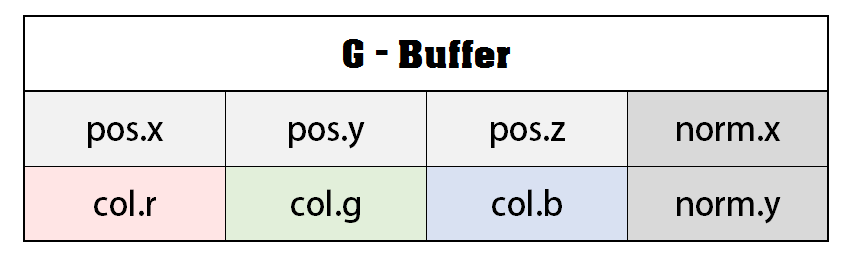
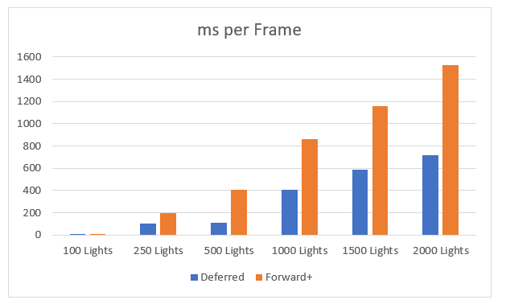
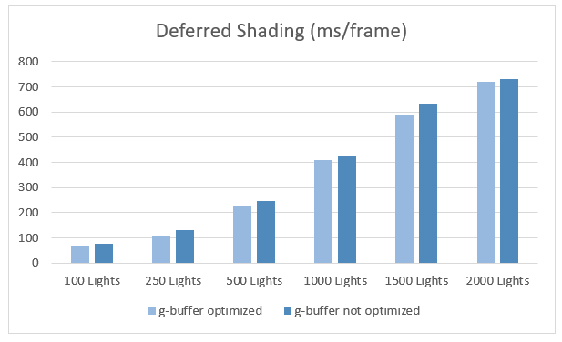

# **University of Pennsylvania, CIS 565: GPU Programming and Architecture, Project 5:**

# **Clustered Forward Plus and Deferred Shaders**

Tested on: Windows 10, Intel Core i7-7700HQ CPU @ 2.80 GHz, 8GB RAM, NVidia GeForce GTX 1050

       

- [Things Done](#things-done)

- [In-Depth](#in-depth)

- [Time Analysis](#time-analysis)
 
- [Final Thoughts](#final-thougts)

 

____________________________________________________

 
The goal of this project was to create two shaders: - Clustered Forward Plus and Clusterred Deferred. Clustering is when you divide the entire scene into three-dimensional blocks called clusters. For a more in-depth explanation of clustering see [this post](http://www.humus.name/Articles/PracticalClusteredShading.pdf).

Deferred Shading is when you simply store the fragment data in a separate g-buffer, and then perform computations at the end. Therefore the scene's shading is no longer dependent upon the number of lights. So combining both makes for a very efficient shader!

### Things Done

#### Core Features

 - [x] Clustered Forward Plus Shader
 - [x] Clustered Deferred Shader

 #### Optimizations
 
  - [x] Two-Component Normals
  - [x] Pack the values into two vec4's
  - [x] Blinn-Phong Shading
  - [ ] Recreate world_position using nothing but depth and camera matrices (the code currently supports this being added, I just haven't had the time to do the math)

### In-Depth:

#### Clustering:

Clustering took me forever to get right. I initially started with Avalanche's reference implementation. It was practically verbatim. It didn't work. I tried everything and it was still patchy. See `clustered.js` for more. So just did the plane-point distance check that Austin briefly explained in class. I pulled the formula for the caluclation from [this Stack Overflow post](http://bit.ly/GPU-HW5-Ref1). For the z-checking, because the planes are axis aligned, I just get the starting tip of the sphere and the end tip by offseting the sphere's center's z by the radius.

###### Debug Views!

Albedo:

Absolute Normal View:

Depth:

#### Deferred Shading:

I'm skipping over Forward+ because there is essentially nothing more to it than the clustering. The deferred shading was actually more fun because I had already done the clustering part which is not fun at all.

###### G-Buffer Optimizationd:

My g-buffer for deferred shading basically looks like this:

As you can see, that is almost as packed as it gets (more on that later). For the g-buffer I basically just have the position and the color, and then I sneak in the normal as part of both of them. I only have the x and the y component as I can compute the z later. The problem I had though was that my z was sometimes negative. This is normal if you're dealing with World Space coordinates. So I work with the absolute value of the z coordinate as all we really need the normal for in my implementation is shading and in my case it we need the absolute value any way. This however threw my Blinn-Phong calculations off and I had to adjust my code accordingly. It still works beautifully though!

###### Blinn-Phong Shading:

Blinn-Phong shading was fairly straightforward. I took the formulas straight from the 560 Slides. I had to do slight modifications to deal with the stuff in view space but other than that, it took like 4-5 hours to do, which considering how long it took to do any other feature is nothing. Here is what the highlights look. Quick note though, this is in pure white and not the *exact* same as how it contribute in the final image because I change a lot from this view to the final shading calculation. It is still very cool though!!

### Time Analysis

For the timing analysis I first compare the different shading techniques. We first have the Forward Shader. That's just normal shading. It's also very slow (comparitively). It also breaks my timing measurer so it's omitted from these results. We then have the clusterred forward plus. This is basically Forward shading but the lights in the scene are distributed into clusters. Then we finally have Clustered Deferred Shading. That's where you have lights that are split into clustered but instead of doing the shading per light and fragment, you just store the fragment's values in a g-buffer and read from that at the end. This makes your code scale linearly with respect to light count. As opposed to forward where it scales exponentially. Here is a timing graph comparing all three types with diffrerent light counts (in ms). 

Then I made the g-buffer optimization. Since I sorta built my code to be two vec4's from the start I actually had to make my code less optimized to measure it and compare. Below are the measurements:

Overall, you can see a consistent gain for each light count, but as expected since this is essentially a "constant" change, that amount gradually becomes less and less relevant as the light count increases.

### Final Thoughts

I did not enjoy this project. It was less enjoyable than the rest as I felt that it was too niche of a field. Real time rasterization is one of the fields in graphics which I am settled on not liking. I'm sure people who are into gaming may have enjoyed this. But I did not.
