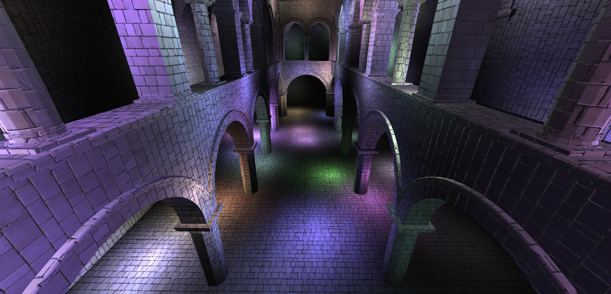
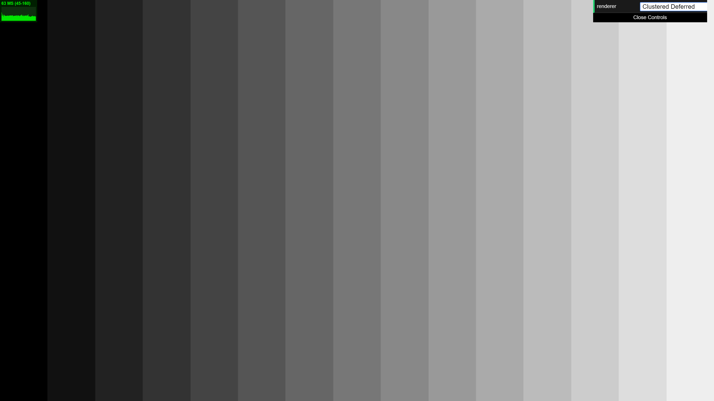
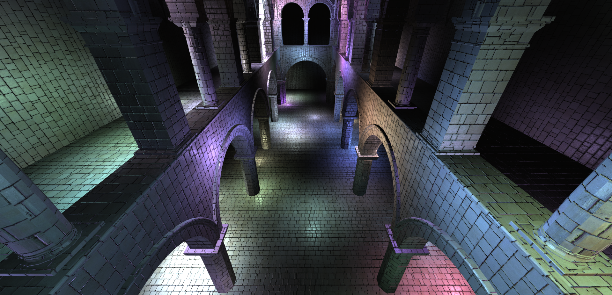
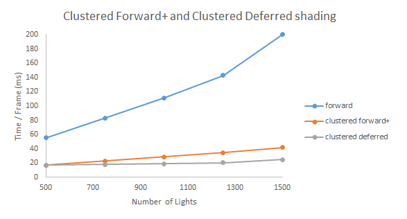
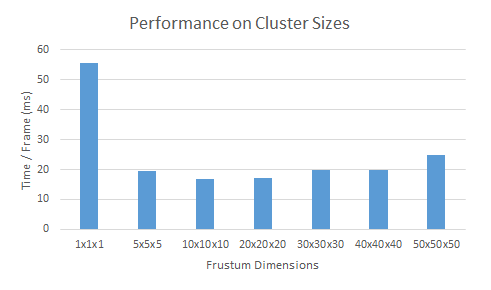

WebGL Clustered Deferred and Forward+ Shading
======================

**University of Pennsylvania, CIS 565: GPU Programming and Architecture, Project 5**

Sarah Forcier

Tested on GeForce GTX 1070

### Live Demo(http://sarahforcier.github.io/Project5B-WebGL-Deferred-Shading)

### Overview

This project implements clustered forward+ and deferred shading. These methods improve performance for scenes with many dynamic lights. Typical forward shading is slow in this case because each fragments is shaded for each light in the scene even if the light does not affect the fragment or the fragment is occluded. Deferred shading solves the latter problem by only shading non-occluded fragments. Clustered forward+ shading solves the other problem by computing which lights effect each fragment and only shading with those lights.   

### Clustered Forward +

The method divides the viewing frustum into clusters and computes the number of lights that overlap each cluster and their indices. Then during shading, each fragment in every cluster can compute shading on just the lights that influence the cluster. Because the clusters are divided in view space, the clusters in the x and y plan are evenly distributed across screen space, as seen below. 

| X Clusters | Y Clusters | Z Clusters | 
| ----------- | ----------- | ----------- |
|  |  |  | 

On the CPU, the minimum and maximum cluster bounds are found for each light. The cluster bounds are defined by planes intersecting the eye position and evenly divide the frustum in each direction. First the cluster is found that contains the light. Then the distance between the light and each plane of the cluster bounds is calculated starting from the closest planes to the light and moving out. The boundary is found when the distance becomes greater than the light's radius. Every time a light is found to influence a cluster, the light count for that cluster is increased and the light's index is added to a texture. 

| Number of Lights per Cluster |
| ----------- |
|  |

#### Blinn-Phong Shading

Blinn-Phong Shading was added without any effect on performance since the implemented shading model does not require additional textures. 

### Clustered Deferred

| Albedo | Normal | Position |
| ----------- | ----------- | ----------- |
|  |  |  |

Deferred Shading takes a 2-pass approach to fragment shading. In the first pass, all the visible fragments write shading properties to a g-buffer. In the second pass, these properties are used to calculate the final color and output to the framebuffer. This second pass only allows shading computation to be computed for non-occluded fragments. For a simple scene, the properties stored in the g buffer are color, position, and normal, as shown below.  

| X | Y | Z | A |
| ----------- | ----------- | ----------- | ----------- |
| color.r | color.g | color.b | color.a |
| position.x | position.y | position.z | 1.0 |
| normal.x | normal.y | normal.z | 0.0 |

#### 2-component normals

This g-buffer layout is not optimal because often the color does not have an alpha value (in fact rendering with alpha in deferred shading is very difficult because the method relies on only having to shade on non-occluded fragments, but with alpha < 1.0, some of the occluded fragments would need to be shaded) and the fourth channels for the position and normal are not used. Instead, 2 components of the normal can be packed into these channels, and the last component can be calculated during shading based on normalization.

| X | Y | Z | A |
| ----------- | ----------- | ----------- | ----------- |
| color.r | color.g | color.b | norm.x |
| position.x | position.y | position.z | norm.y |

### Performance

Clustered Forward+ performs much better for scenes with multiple lights because the implementation focuses on reducing the number of required shading computations. Adding Deferred Shading to the clustered forward+ implementation adds a small performance improvement.   

More clusters to divide up the lights in the scene performs better, but when there are too many clusters, the light texture gets larger and can slow down the shader and calculating the minimum and maximum clusters on the CPU takes longer when more iterations are required. 

### Credits

* [Three.js](https://github.com/mrdoob/three.js) by [@mrdoob](https://github.com/mrdoob) and contributors
* [stats.js](https://github.com/mrdoob/stats.js) by [@mrdoob](https://github.com/mrdoob) and contributors
* [webgl-debug](https://github.com/KhronosGroup/WebGLDeveloperTools) by Khronos Group Inc.
* [glMatrix](https://github.com/toji/gl-matrix) by [@toji](https://github.com/toji) and contributors
* [minimal-gltf-loader](https://github.com/shrekshao/minimal-gltf-loader) by [@shrekshao](https://github.com/shrekshao)
