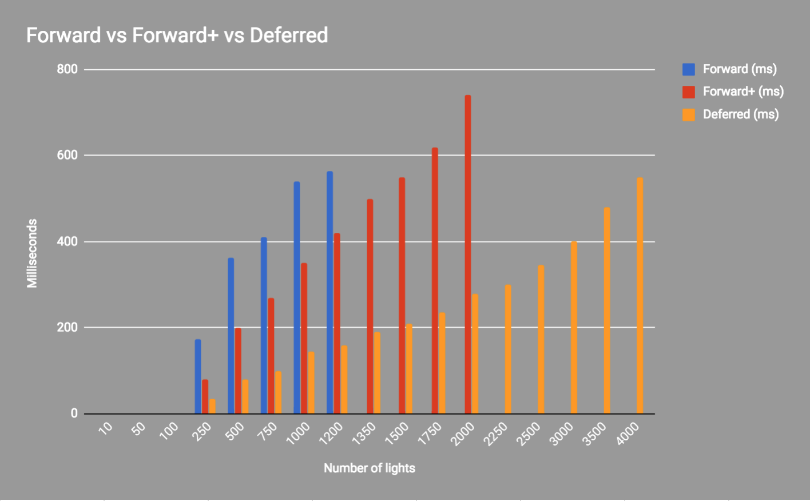
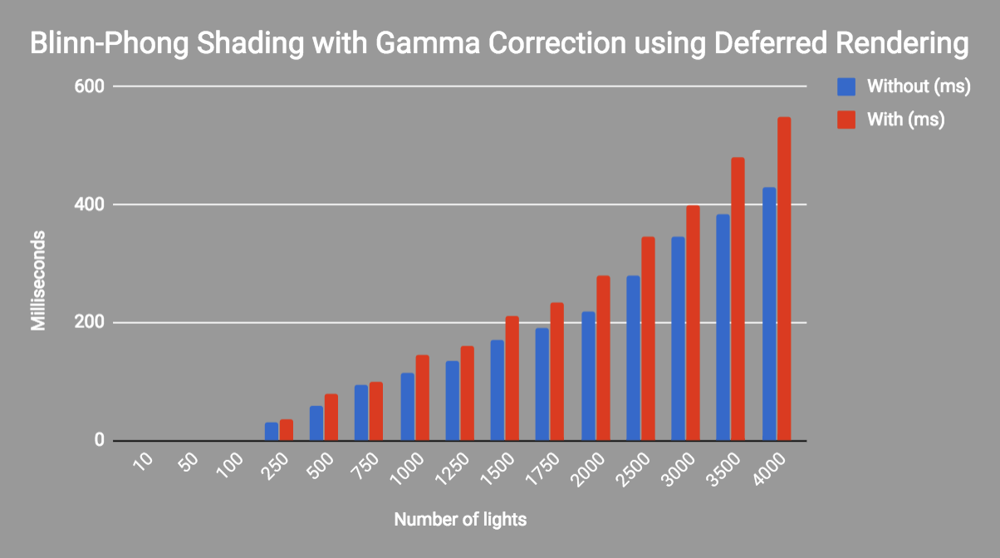
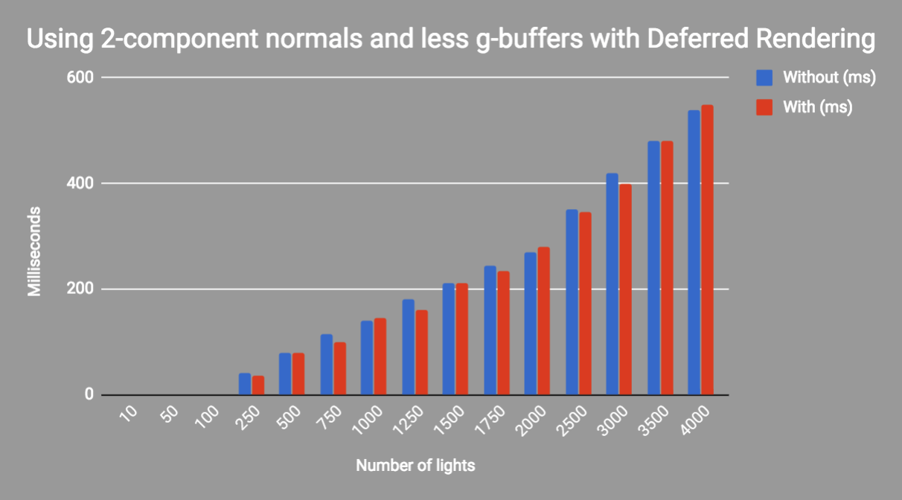

WebGL Clustered Deferred and Forward+ Shading
======================

**Course project #5 for CIS 565: GPU Programming and Architecture, University of Pennsylvania**

* (TODO) YOUR NAME HERE
* Tested on: (TODO) **Google Chrome 62.0.3202.62** on
  - Mac OSX 10.10.5
  - Processor: 2.5 GHz Intel Core i7
  - Memory: 16 GB 1600 MHz DDR3
  - Graphics: Intel Iris Pro 1536 MB

## Project Overview
The goal of this project was to get an introduction to Clustered Deferred and Clustered Forward+ Shading in WebGL. 

### Live Online

### Demo Video/GIF
#### Forward+

#### Deferred 

### Features and Optimizations
* Clustered Forward+ shading
* Clustered Deferred shading with g-buffers 
* Blinn-Phong shading (diffuse + specular) for point lights
* Gamma Correction
* Optimized g-buffer format (by reducing the number and size of g-buffers)
  - Packing values together into vec4s
  - Using 2-component normals

### Algorithm Descriptions

#### Forward Rendering
Forward rendering works by rasterizing each geometric object in the scene. For each light in the scene, each object is shaded according to their material/light-type, which means there is one shader per material/light-type. This means that every geometric object has to consider every light in the scene. 

One optimization is to remove geometric objects that are occluded or do not appear in the view frustum of the camera. This can also be applied to lights as well. You can perform frustum culling on the light volumes before rendering the scene geometry. 

Object culling and light volume culling provide limited optimizations for this technique and light culling is often not practiced when using a forward rendering pipeline. It is better to limit the number of lights that affect the entire object.

#### Clustered Forward+

Clustered Forward+ is a rendering technique that combines forward rendering with tiled light culling to reduce the number of lights that must be considered during shading. Forward+ primarily consists of two stages: light culling and forward rendering.

The first pass of the Forward+ rendering technique uses a uniform grid of tiles in screen space to partition the lights into per-tile lists.

Rather than using 2D tiles, we use 3D versions of them called "clusters". Lights in the scene are divided into these clusters. Each cluster represents a portion of the camera frustum that we currently see as we move around in the scene. Each cluster is stored as a 2D texture, which holds information about how many lights each cluster contains, and a list of which lights they are. 

The second pass uses a standard forward rendering pass to shade the objects in the scene but instead of looping over every dynamic light in the scene, the current pixel’s screen-space position is used to look-up the list of lights in the cluster that was computed in the previous pass. The light culling provides a significant performance improvement over the standard forward rendering technique as it greatly reduces the number of lights that must be iterated to correctly light the pixel. 

#### Clustered Deferred

Clustered deferred works by rasterizing all of the scene objects (without lighting) into a series of 2D image buffers (g-buffers) that store the geometric information that is required to perform the lighting calculations in a later pass. The information that is stored into the 2D image buffers can be things like:

* screen space depth
* surface normals
* diffuse color

After the g-buffer has been generated, the geometric information can then be used to compute the lighting information in the lighting pass. The lighting pass is performed by rendering each light source as a geometric object in the scene. Each pixel that is touched by the light’s geometric representation is shaded using the desired lighting equation. This is done using the same clustering technique as described in the Forward+ section above.

Advantages compared to forward rendering:

- It decouples lighting from the scene complexity 
- You only transform and rasterize each object once 
- The expensive lighting calculations are only computed once per light per covered pixel. 

Disadvantages:
- Memory bandwidth usage: must read g-buffer for each light
- Must recalculate full lighting equation for each light
- Can't handle transparent objects because only have g-buffers for front-most fragment

More on transparency (from [Rendering Technique Comparisons](https://www.3dgep.com/forward-plus/)): 
One of the disadvantage of using deferred shading is that only opaque objects can be rasterized into the G-buffers. The reason for this is that multiple transparent objects may cover the same screen pixels but it is only possible to store a single value per pixel in the G-buffers. In the lighting pass the depth value, surface normal, diffuse and specular colors are sampled for the current screen pixel that is being lit. Since only a single value from each G-buffer is sampled, transparent objects cannot be supported in the lighting pass. 

To circumvent this issue, transparent geometry must be rendered using the standard forward rendering technique which limits either the amount of transparent geometry in the scene or the number of dynamic lights in the scene. A scene which consists of only opaque objects can handle about 2000 dynamic lights before frame-rate issues start appearing.

Another disadvantage of deferred shading is that only a single lighting model can be simulated in the lighting pass. This is due to the fact that it is only possible to bind a single pixel shader when rendering the light geometry. This is usually not an issue for pipelines that make use of übershaders as rendering with a single pixel shader is the norm, however if your rendering pipeline takes advantage of several different lighting models implemented in various pixel shaders then it will be problematic to switch your rendering pipeline to use deferred shading.

## Performance Analysis

Compare your implementations of Clustered Forward+ and Clustered Deferred shading and analyze their differences.

Is one of them faster?
Is one of them better at certain types of workloads?
What are the benefits and tradeoffs of using one over the other?
For any differences in performance, briefly explain what may be causing the difference.

==================================================================================================================

Effect Features:
Concise overview write-up of the feature.
Performance change due to adding the feature.
If applicable, how do parameters (such as number of lights, etc.) affect performance? Show data with simple graphs.
    Show timing in milliseconds, not FPS.
If you did something to accelerate the feature, what did you do and why?
How might this feature be optimized beyond your current implementation?

==================================================================================================================

Performance Features:
Concise overview write-up of the feature.
Detailed performance improvement analysis of adding the feature
    What is the best case scenario for your performance improvement? What is the worst? Explain briefly.
    Are there tradeoffs to this performance feature? Explain briefly.
    How do parameters (such as number of lights, tile size, etc.) affect performance? Show data with graphs.
        Show timing in milliseconds, not FPS.
    Show debug views when possible.
        If the debug view correlates with performance, explain how.

TALK ABOUT ---> Optimization for normals to get more correct output: utilizing octahedron normal encoding instead
TALK ABOUT --> DOING VIEW MATRIX * VPOS IS BETTER IN VERTEX SHADER THAN IN FRAGMENT SHADER???

### Credits and Resources

* [Three.js](https://github.com/mrdoob/three.js) by [@mrdoob](https://github.com/mrdoob) and contributors
* [stats.js](https://github.com/mrdoob/stats.js) by [@mrdoob](https://github.com/mrdoob) and contributors
* [webgl-debug](https://github.com/KhronosGroup/WebGLDeveloperTools) by Khronos Group Inc.
* [glMatrix](https://github.com/toji/gl-matrix) by [@toji](https://github.com/toji) and contributors
* [minimal-gltf-loader](https://github.com/shrekshao/minimal-gltf-loader) by [@shrekshao](https://github.com/shrekshao)

* [CIS 460 lecture notes on camera frustum](https://docs.google.com/presentation/d/e/2PACX-1vQrlrzC6XQCvRCQTr9k5dtUCpZFnbqlbcYXoFt1lcjBRdn_r4HD7GabLiGo7Ht0Dxvp4w_cWdV_ZaYh/pub?start=false&loop=false&delayms=60000&slide=id.g2492ec6f45_0_215)
* [Blinn-Phong Shading Model](https://en.wikipedia.org/wiki/Blinn%E2%80%93Phong_shading_model)
* [Foward vs Deferred Rendering](https://gamedevelopment.tutsplus.com/articles/forward-rendering-vs-deferred-rendering--gamedev-12342)
* [glMatrix Documentation](http://glmatrix.net/docs/module-vec3.html)
* [Intro to real-time shading of many lights SIGGRAPH course notes](https://newq.net/dl/pub/SA2014ManyLightIntro.pdf)
* [Practical Clustered Shading - Avalanche Studios](http://www.humus.name/Articles/PracticalClusteredShading.pdf)
* [Rendering Technique Comparisons](https://www.3dgep.com/forward-plus/)

**Normal Compression** 
* [Compact Normals for g-buffers](https://aras-p.info/texts/CompactNormalStorage.html)
* [(Not implemented) Octahedron Normal Encoding](https://knarkowicz.wordpress.com/2014/04/16/octahedron-normal-vector-encoding/)

**Other good resources (unused)**
* [Extracting View Frustum Plans From Projection Matrix](http://gamedevs.org/uploads/fast-extraction-viewing-frustum-planes-from-world-view-projection-matrix.pdf)
* [BVH light storage](https://worldoffries.wordpress.com/2015/02/19/simple-alternative-to-clustered-shading-for-thousands-of-lights/)
* [Deferred Rendering Tutorial](http://www.codinglabs.net/tutorial_simple_def_rendering.aspx)
* [Deferred Lighting](https://www.opengl.org/discussion_boards/showthread.php/167687-Deferred-lighting)