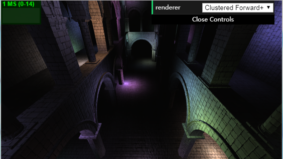
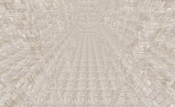
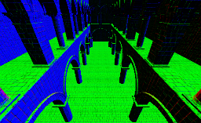
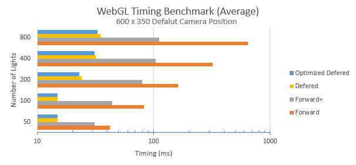

University of Pennsylvania, CIS 565: GPU Programming and Architecture, Project 5 WebGL Clustered Deferred and Forward+ Shading
======================

* Ziyu Li
* Tested on: Windows 7, Intel Core i7-3840QM @2.80GHz 16GB, Nvidia Quadro K4000M 4GB

## Features
#### All Features
 - Clustered Forward+
 - Clustered Deferred
 - Deferred Blinn-Phong Shading
 - Optimized G-Buffer (2-Component Normals)

#### Forward

#### Forward Plus

#### Defered

#### Shading

| Lambert | Blinn-Phong |
| ----- | ----- |
|  |  |

#### G-Buffer
| Albedo | Normal | Position | Depth |
| ----- | ----- | ----- | ----- |
|  |  |  |  |

## Performance Analysis
#### Benchmark
Based on benchmark, the fastest implementation is Clustered Deferred under most of conditions and all of those three methods can easily handle the scenairo which the camera is far from the scene. However, Forward Shading is slightly better the other two when the scene only contains one or two lights, and if the scene has more than 30 lights, the Deferred Shading and Forward Plus are much better than Forward one. The reason of that is the when the scene contains few lights, the Forward Shading does not involve too clusters calculation which save a lot of time, but after the number of the lights are greater than a certain amount, the clustered shading can really help to reduce the calculation where the areas which lights does not lit on. In some situations, when the camera is really close to the light, the Forward+ can barely improve the performance. Since the Deferred Shading using g-buffer which is different from Forward(+) approach, it could really boost the performance under such condition.

#### Optimized G-Buffer (2 G-Buffer)

Compact 2 G-Buffer

| G-Buffer | R          | G          | B          | A        |
|:--------:|------------|------------|------------|----------|
|     1    |    Depth   |    0.0     |     0.0    | Normal.X |
|     2    | Albedo.R   | Albedo.G   | Albedo.B   | Normal.Y |

Normal 2 G-Buffer

| G-Buffer | R          | G          | B          | A        |
|:--------:|------------|------------|------------|----------|
|     1    | Position.X | Position.Y | Position.Z | Normal.X |
|     2    | Albedo.R   | Albedo.G   | Albedo.B   | Normal.Y |

3 G-Buffer

| G-Buffer | R          | G          | B          | A        |
|:--------:|------------|------------|------------|----------|
|     1    | Position.X | Position.Y | Position.Z | 0.0 |
|     2    | Albedo.R   | Albedo.G   | Albedo.B   | 0.0 |
|     3    | Normal.X | Normal.Y | Normal.Z | 0.0 |

Pack values together into vec4s, use 2-component normals and re-allocate the x and y component into spared texture memory can achieve optimized G-Buffer. Theoretically, there should be some performance increasement by reducing the allocation of textures in g-buffer. But actually, based on the benckmark in above section, optimized G-Buffer decrease the time approx. less than 10% which seems trivial on performance boost. The reason of cause this could be some unnecessary perperties passing or reduce the allocation size of albedo since it only contains three 8-bit channels.

### Credits

* [Three.js](https://github.com/mrdoob/three.js) by [@mrdoob](https://github.com/mrdoob) and contributors
* [stats.js](https://github.com/mrdoob/stats.js) by [@mrdoob](https://github.com/mrdoob) and contributors
* [webgl-debug](https://github.com/KhronosGroup/WebGLDeveloperTools) by Khronos Group Inc.
* [glMatrix](https://github.com/toji/gl-matrix) by [@toji](https://github.com/toji) and contributors
* [minimal-gltf-loader](https://github.com/shrekshao/minimal-gltf-loader) by [@shrekshao](https://github.com/shrekshao)
