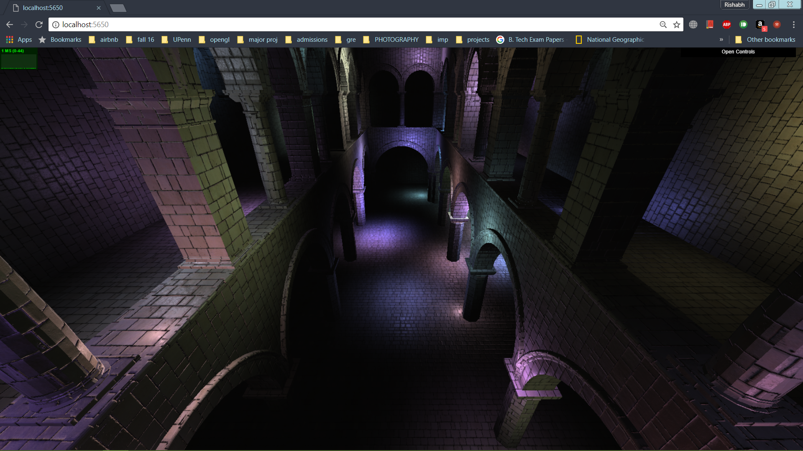
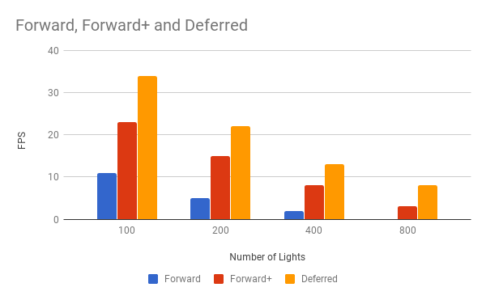
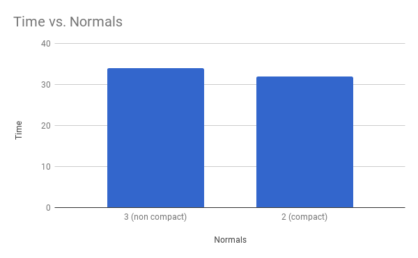

WebGL Clustered Deferred and Forward+ Shading
======================

**University of Pennsylvania, CIS 565: GPU Programming and Architecture, Project 5**

* Rishabh Shah
* Tested on: **Version 62.0.3202.75 (Official Build) (64-bit)** on
  Windows 10, i7-6700HQ @ 2.6GHz 16GB, GTX 960M 4096MB (Laptop)

### Live Online

### Demo Video/GIF

### Overview
In this project, I worked on implementing Clustered Forward+ and Clustered Deferred renderers. Clustered Forward+ renderer works in a similar way as a Forward rendered, but with one optimization. Here, we divide the view frustum in slices in three axes and bin the lights into the clusters. So in the fragment, only the lights in the cluster of the fragment need to be iterated through. Clustered Deferred takes this one step further by changing the way the scene is rendered. A Deferred shader postpones shading until the end. So we do per-pixel shading and not per-fragment. When shading is the heaviest stage, this is highly efficient than forward methods.

#### Features
* Clustered Forward+
* Clustered Deferred
* Blinn-Phong shading (diffuse + specular) for point lights (in Clustered Deferred)
* Simple Toon shading (in Clustered Forward+)
* Optimizations
 * Pack values together into vec4s
 * Use 2-component normals

### Performance Analysis

#### Forward vs. Forward+ vs Deferred

As expected, Deferred shading is the fastest followed by Forward+ followed by Forward. The tests were performed using 100 lights in the sponza model.

#### 3-Buffers vs 2-Buffers

Deferred shading requires passing all the data between shaders using g-buffers. For this implementation, I tried reducing the number of g-buffers by packing position, color and normals in 2 vec4s. This can be done by storing the x and y components of the normal in the 4th position of the 2 g-buffers, and computing the z in the fragment shader. This is known as screen-space normals. But the method gives low performance advantage, and causes artefacts as seen below. So the deployed version does not contain that code. But it can be found in the files in comments.

#### Lambertian Shading

#### Blinn-Phong Shading

#### Toon Shading

### Credits

* [Three.js](https://github.com/mrdoob/three.js) by [@mrdoob](https://github.com/mrdoob) and contributors
* [stats.js](https://github.com/mrdoob/stats.js) by [@mrdoob](https://github.com/mrdoob) and contributors
* [webgl-debug](https://github.com/KhronosGroup/WebGLDeveloperTools) by Khronos Group Inc.
* [glMatrix](https://github.com/toji/gl-matrix) by [@toji](https://github.com/toji) and contributors
* [minimal-gltf-loader](https://github.com/shrekshao/minimal-gltf-loader) by [@shrekshao](https://github.com/shrekshao)
