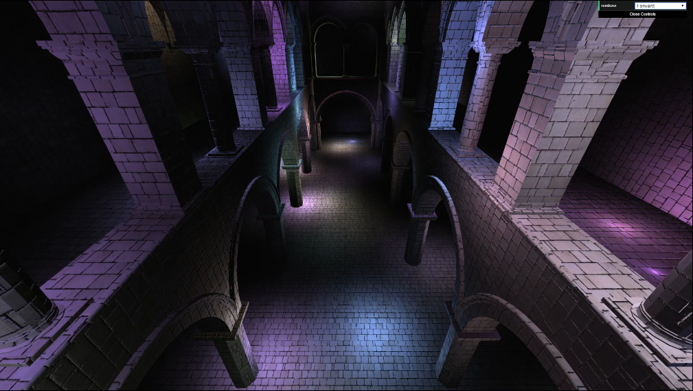
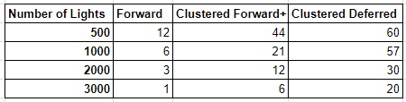
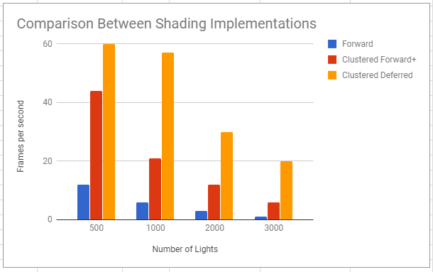
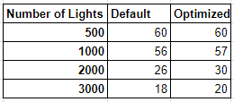
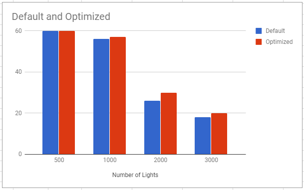

WebGL Clustered Deferred and Forward+ Shading
======================

**University of Pennsylvania, CIS 565: GPU Programming and Architecture, Project 5**

* Mohamed Soudy
* Tested on: **Google Chrome 62.0.3202.75**
  Windows 10, Intel(R) Xeon(R) CPU E5-2687W v3 @ 3.10GHz 32GB, GTX 980 8GB (SIG Lab)

## Live Online

## Demo Video/GIF

## Overview

Implementations of forward, forward clustering and deferred clustering with Blinn-Phong shading and G-buffer optimizations.

## Analysis

When comparing the performance of all three implementations, deferred clustering proves to be much faster than forward
and forward clustering as can be seen in the table and chart below. Forward crashes with 3000 plus lights because without
clustering all the lights are checked for every fragment. With forward clustering however, only the lights that are within
a cluster are checked which significantly improves performance.

Clustered deferred is the fastest because it only deals with one fragment per pixel read from the G-buffer, whereas with 
the other two implementations all the fragments of a specific pixel are shaded.

The following chart compares the performance difference of using 2 vs 3 G-buffers in deferred shading. By compressing normals
to only store the x and y value, we can fit all the required data (position, color and normal) in only 2 G-buffers.
We can then reconstruct the normal in the shader to get the z value using the magnitude function. This is possible because we 
know that the total sum of the components of a normal should be 1 and since we have the x and y we can easily derive the z value
of the normal.

The performance difference is not very significant but using 2 G-buffers instead of the 3 definitely improves performance as can 
be seen in the chart below. I predict the difference will be larger when tested with a larger number of lights.

## Credits

* [Three.js](https://github.com/mrdoob/three.js) by [@mrdoob](https://github.com/mrdoob) and contributors
* [stats.js](https://github.com/mrdoob/stats.js) by [@mrdoob](https://github.com/mrdoob) and contributors
* [webgl-debug](https://github.com/KhronosGroup/WebGLDeveloperTools) by Khronos Group Inc.
* [glMatrix](https://github.com/toji/gl-matrix) by [@toji](https://github.com/toji) and contributors
* [minimal-gltf-loader](https://github.com/shrekshao/minimal-gltf-loader) by [@shrekshao](https://github.com/shrekshao)
