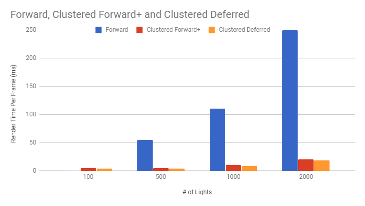
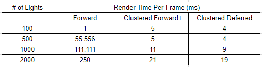
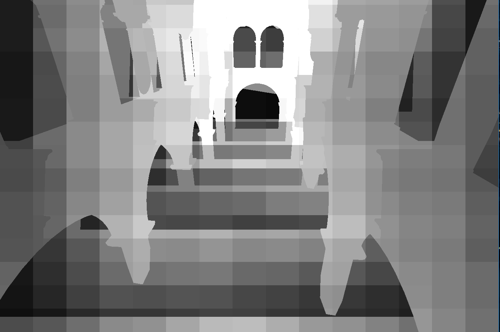
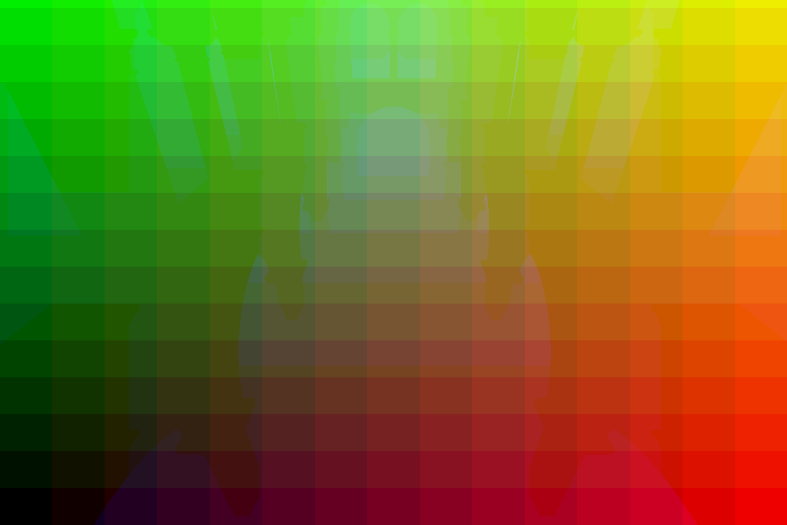

WebGL Clustered Deferred and Forward+ Shading
======================

**University of Pennsylvania, CIS 565: GPU Programming and Architecture, Project 5**

* Charles Wang
* Tested on: Windows 10, i7-6700K @ 4.00GHz 16GB, GTX 1060 6GB (Personal Computer) Google Chrome 62 and Mozilla Firefox 56.0.1

Clustered Forward+ Renderer with 2000 lights

## **Project Goals and Implementational Details**

In this project I implemented: 
* Light clustering based on camera frustum slices
* Forward+ rendering
* Deferred shading
* G Buffer compacting normal x,y values into w slots
* Blinn-Phong shading

## **Performance Analysis**

### Comparing time for each rendering method with increasing light numbers

All measurements are taken with the same scene with the same geometry and a constant light radius of 2 units across all lights. Larger light radii and varying cluster sizes may also affect runtime. However, first we want to test how magnitude of elements is reflected in each rendering method. Also, the max number of lights per cluster is increased with each number of lights so lights don't get clipped (so this analysis can be understood more practically).

The data was collected visually from the stat.js overlay, thus these measurements are more of an estimation than a tight measurement.

The naive Forward renderer only outperforms the clustered renderers for scenes with very few lights. This is because there are few enough lights such that iterating over every light per fragment is not as costly as iterating over every light for clusters. We do notice that the clustered methods outperform the naive method very quickly and by a huge margin once we start introducing 1000s of lights. 

### Comparing g_buffer packing normals vs dedicated g_buffer

Actually, for a scene with 3000 lights, compacting the gbuffer lead to about a 3 ms slow down (33ms vs 36ms without compacting).

I think this happened because I didn't gain much from compacting data and introduced another computation in converting the surface normal from world space 3d to screen space 2d (with some view matrix transformations). I only compacted from 3 gbuffers to 2 gbuffers. If there were more AOVs for my project, then perhaps I would gain more from compacting g buffers.

### Cool AOVs/Debugging views
Number of lights in each cluster

Cluster id (x,y,z) in (r,g,b)

### Credits

* [Three.js](https://github.com/mrdoob/three.js) by [@mrdoob](https://github.com/mrdoob) and contributors
* [stats.js](https://github.com/mrdoob/stats.js) by [@mrdoob](https://github.com/mrdoob) and contributors
* [webgl-debug](https://github.com/KhronosGroup/WebGLDeveloperTools) by Khronos Group Inc.
* [glMatrix](https://github.com/toji/gl-matrix) by [@toji](https://github.com/toji) and contributors
* [minimal-gltf-loader](https://github.com/shrekshao/minimal-gltf-loader) by [@shrekshao](https://github.com/shrekshao)
