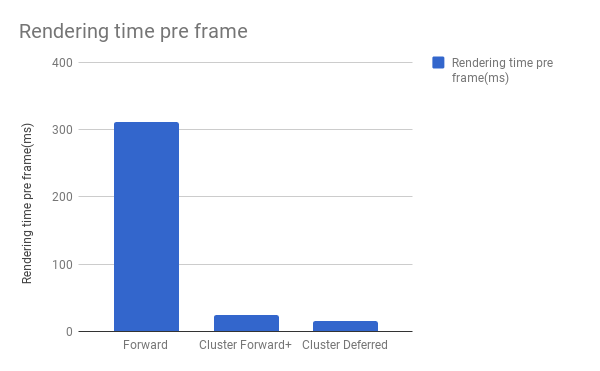
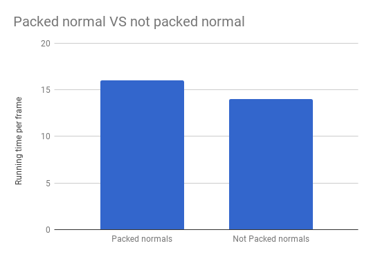

WebGL Clustered Deferred and Forward+ Shading
======================

**University of Pennsylvania, CIS 565: GPU Programming and Architecture, Project 5**

* Jiahao Liu
* Tested on: **Google Chrome 61.0.3163.100(64 bits)** on
  Windows 10, i7-3920XM CPU @ 2.90GHz 3.10 GHz 16GB, GTX 980m SLI 8192MB (personal computer)

### Live Online

### Demo Video/GIF

Project Introduction
======================

This project bases on WebGL and JavaScript. The main idea for this project is to boost the render performance for rendering scene with a lot of lights effect.

The main algorithm used in this project includes clustered forward+ rendering and clustered deferred rendering.

Features Introduction
======================

### Clustered Forward+

* Divide the whole scene into clusters based on screen tile dividing and camera space z dividing.
* Build a data structure to keep track of how many lights are in each cluster and what their indices are
* Render the scene using only the lights that overlap a given cluster

###	Clustered Deferred

* Reuse clustering logic from Clustered Forward+
* Store vertex attributes in g-buffer for later use.
* Only do lighting on the nearest fragments. 
* Read g-buffer in fragment shader and applying clustered based light to produce final output.

###	Effects

* Implement deferred Blinn-Phong shading for point lights.

###	Optimizations

* Pack normal vector into vec2 and stored in g-buffer. 
* Use 2 g-buffer instead of 4 g-buffer using proper compress technique.
	
Performance Analysis
======================

###	Different running time for different render techniques

* Maximum number of lights in a cluster: 1000
* Total lights number in the scene: 1500
* Points light radius: 3.0

Naive Forward rendering will go through all the lights in every fragment to calculate the render result.

Clustered Forward+ rendering gives a much better performance than the naive methods. This difference becomes even more obvious when the lights reaches a huge amount.

Comparing to Clustered Forward+, Cluster Deferred rendering will not apply light computation to those fragments that locates behind, but requires extra time to transfer the data using g-buffer. When the light is pretty complex, the performance of deferred rendering will becomes better then cluster forward+.

###	Packed normal VS not packed normal

* Maximum number of lights in a cluster: 1000
* Total lights number in the scene: 1500
* Points light radius: 3.0

Packed normal will require less bandwidth to transfer data, but requires more ALU periods to calculate the true normal. Also all ways of packing normal will somehow lose accuracy comparing to the original normal. Running time is not saved too much, but the transfer bandwidth is greately decreased.

### Credits

* [Three.js](https://github.com/mrdoob/three.js) by [@mrdoob](https://github.com/mrdoob) and contributors
* [stats.js](https://github.com/mrdoob/stats.js) by [@mrdoob](https://github.com/mrdoob) and contributors
* [webgl-debug](https://github.com/KhronosGroup/WebGLDeveloperTools) by Khronos Group Inc.
* [glMatrix](https://github.com/toji/gl-matrix) by [@toji](https://github.com/toji) and contributors
* [minimal-gltf-loader](https://github.com/shrekshao/minimal-gltf-loader) by [@shrekshao](https://github.com/shrekshao)
* [Encode normals](https://aras-p.info/texts/CompactNormalStorage.html#method03spherical) by [Aras Pranckevičius](https://aras-p.info/)
