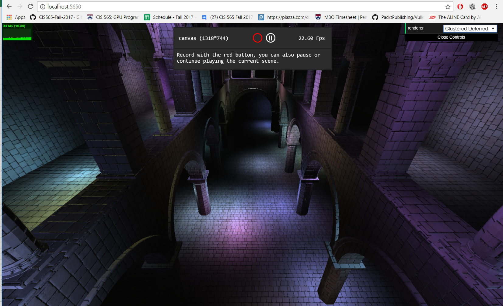
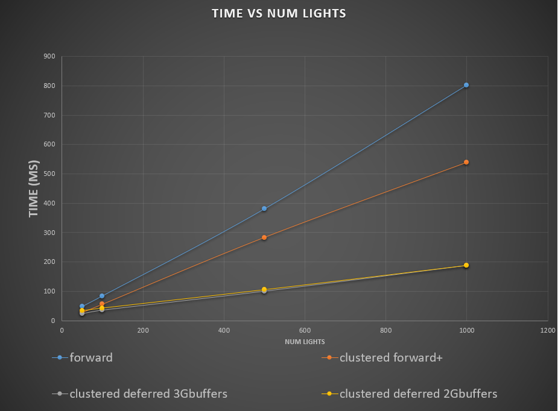
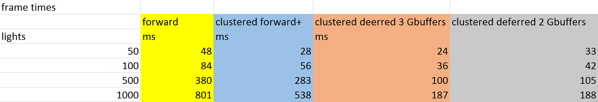
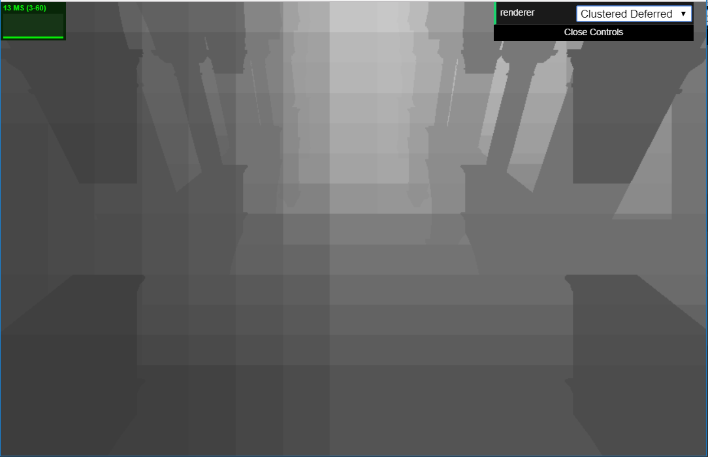
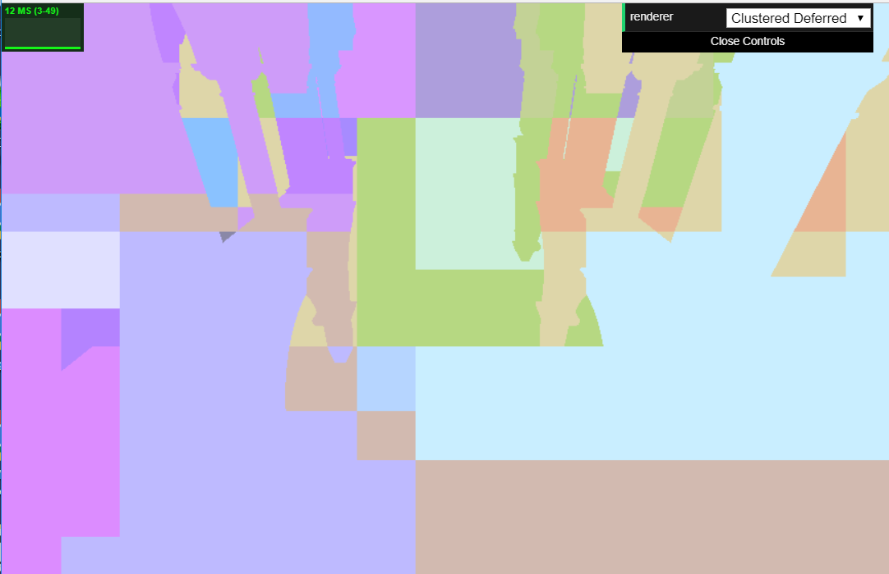
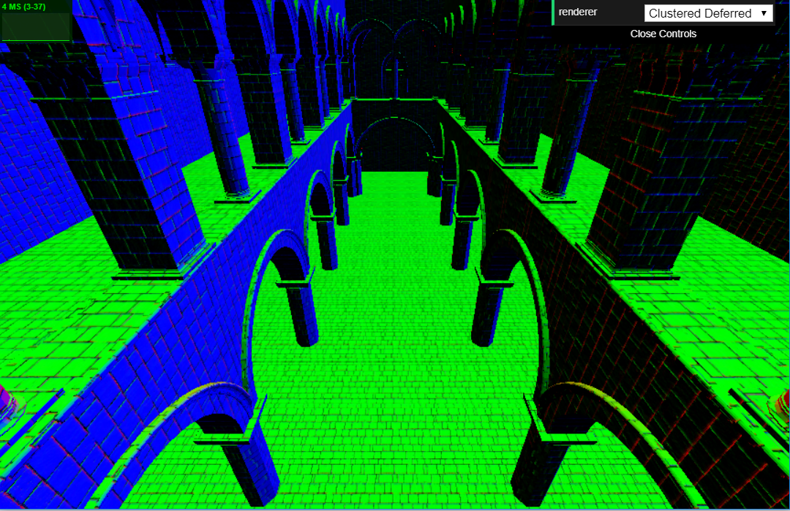
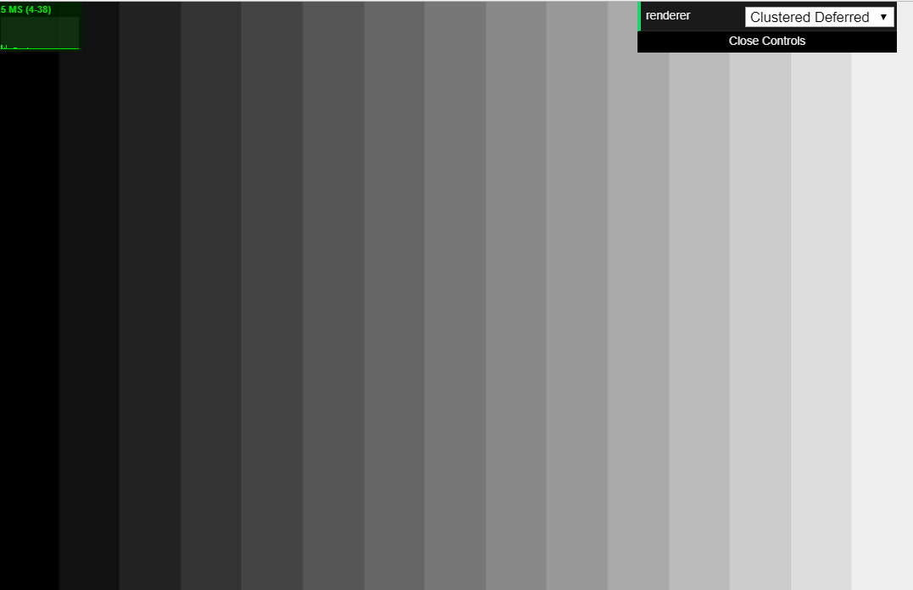
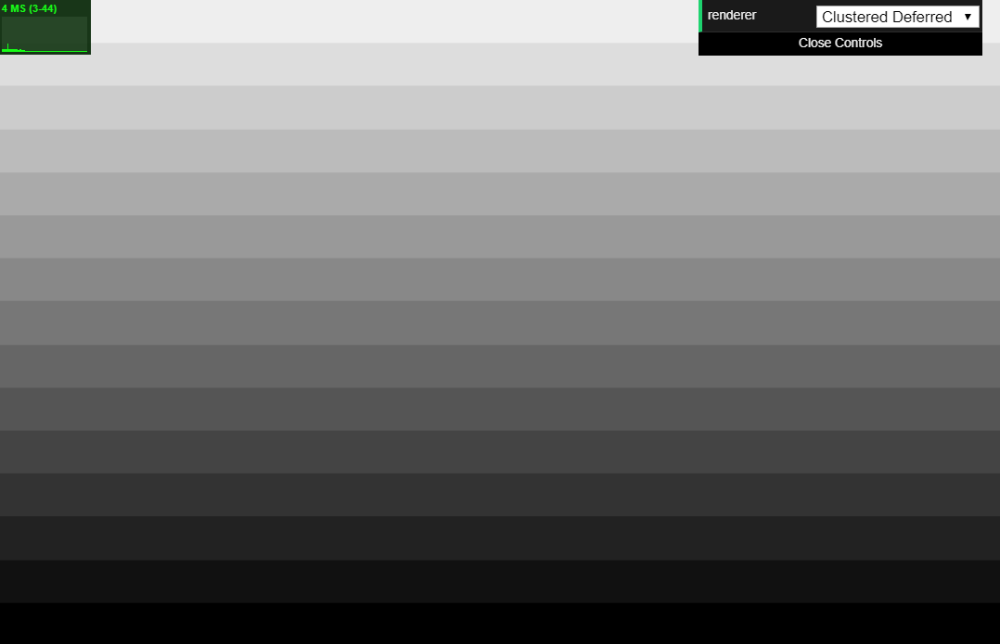
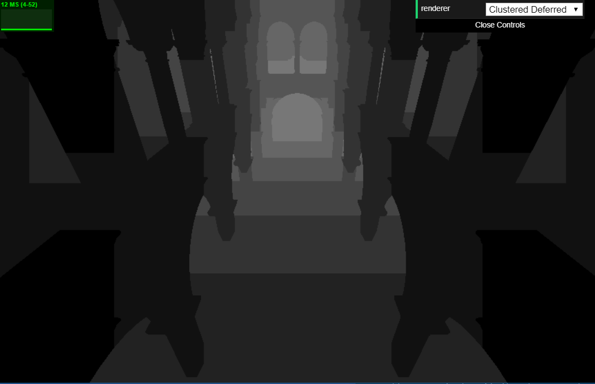
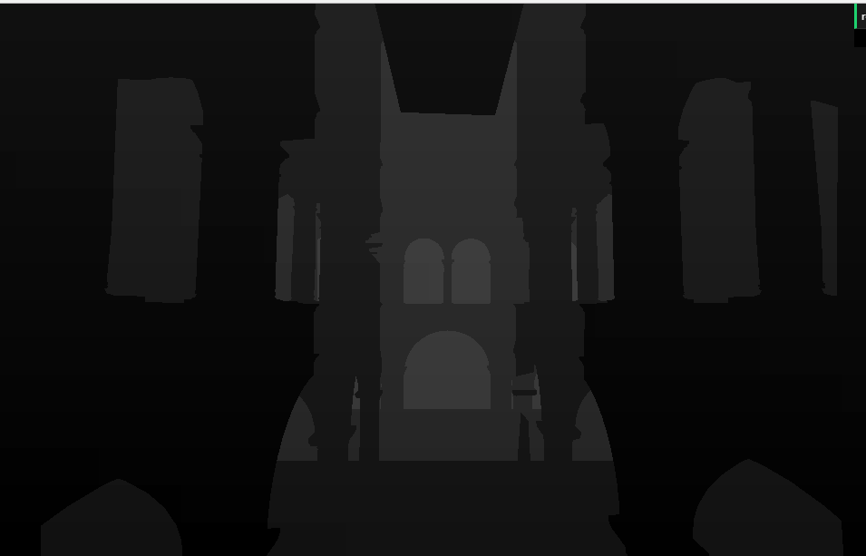

**University of Pennsylvania, CIS 565: GPU Programming and Architecture,
Project 5 - WebGL Clustered Forward+ and Clustered Deferred Renderers**

* Josh Lawrence
* Tested on: Windows 10, i7-6700HQ @ 2.6GHz 8GB, GTX 960M 2GB  Personal

**Overview** 
For pro's and cons of forward vs deferred see:
http://www.yosoygames.com.ar/wp/2016/11/clustered-forward-vs-deferred-shading/

For a look at implementation details of creating the clustered data structure see:
http://www.humus.name/Articles/PracticalClusteredShading.pdf

**Highlights** 
It is evident that for large numbers of lights, clustered deferred rendering is superior, followed by clustered forward plus, and finally forward. Forward rendering must shade every fragment that resolved to the pixel (if no early z) for every light. Clustered forward plus must shade every fragment that resolved to the pixel as well but only for lights that affect the fragment's cluster. Clustered deferred uses the light cluster data structure as well (to cull the lights that affect the fragment), but since deferred gets it's shading information from the closest fragment(sourced from the G-buffer render targets in the first pass), clustered deferred has the advantage over clustered forward plus in that it only shades 1 fragment per pixel and not all the fragmenents that resolved to that pixel.
 
 
One optimization that can be done for deferred rendering is packing the G-buffer textures as tightly as possible. One way to do this is to not store component values that can be reconstructed later. One G-buffer component that is a good candidate is the normal, since we know the z value must be facing us if it is in camera space, we can just store x and y and reconstruct z later. This optimization however did not save time in the end. Perhaps the globabl memory fetch latency was hidden by non-dependent tasks. Another optimization that can be done is interleaving the texture data instead separating components into their own texture. The nature of caches is that when you request any piece of data in a cache line you get the whole cache line for free. This spatial locality comes in handy when we request the next G-buffer component.Since the whole cache line was fetched on the last request it should be arriving in our local cache, so no need to fetch from global memory since it's on the way, reducing global memory requests/traffic. Although, in the separate texture case, I can see memory coalescing happening across the threads instead of per thread. Further testing would be needed to see if there is actually any benefit. 
 
 
Another optimization that comes to mind is for computing which lights belong in which clusters. The way it is currently done in the code is that for each light you determine the 6 cluster planes that bound it and then loop through those clusters, add 1 to its light count and add the light index to the cluster. As we loop through the x and y cluster planes to see which ones bound the light, we must do plane interesection tests which involve calculating the plane normal(1 sqrt, 1 divide, 2 mults, 1 add), doing a dot product(3 mults, 2 adds) and comparison. 
 
 
The other idea for calculating the clusters is focused on reducing the inner loop cost ( the x and y plane tests which include a sqrt) to a simple add and compare. The main idea is to project a bounding box on the screen to remove the need for explicit plane tests. The idea is as follows: get the camera space xy bound of the light then rotate this square(2 points, ll, ur) in locally space about y then x (euler order yx) to have it ultimately face the viewer, (orthogonal to the ray from the eye to the center of the light sphere), then transform to ndc using projection matrix, do perspective divide. divide ndc into slices and step until you find the bounds.  

 
 
This other way does more computation up front to reduce the computation needed in the inner loops (x and y plane tests). First we must find the angles to rotate the square aabb to face the the camera orthogonally. We need two 2D dot products to get the angles (the sign of the light positions x and y camera space coordinates can be used to determine whether these angles need to be positive or negative), this is 4 mults and 2 adds. Next we need to euler rotate in model space by yx, efficiently done this is 8 mults and 4 adds(2 points to do). Next we need to translate this aabb square back to its position in camera space(we used the camera origin for model space), this is 6 adds(2 points to do). projection mult, effieciently done is 10 mults 2 adds (2 points to do) and the perspective divide is 4 divides (2 points to do, only need x and y ndc coords). 

 
 

The current way looks to have a constant overhead of 5 mults 3 divides and 1 add, a cost per light of 16 mults and 12 adds (view matrix times world light pos) and a cost per x and y plane test of 1 sqrt, 1 divide, 5 mults, 3 adds, and 1 compare. z plane test is simply add and compare and will remain the same across both implementations. 
 
 

The other proposal looks to have a constant overhead of 2 divides (to get the ndc stepping amount for x and y), a per light cost of the original view matrix times world light position to get the light into camera space(16 mults and 12 adds) and an addtional 4 divides, 22 mults, and 14 adds but an x y plane test inner loop cost of 1 add and 1 compare. 

 
 
The outter light loop overhead is 4 divides 38 mults and 26 adds. Looking at http://www.agner.org/optimize/instruction_tables.pdf as a proxy, we can see that for skylake processor floating operations an add is 3 cyles and mult is 5, a divide is 15 and a sqrt is 18. The total raw cycles need for the new method is 60+110+42 = 212 per light(overhead vs the original method) + 2 per plane. These 212 cycles can be compressed depending on data dependencies and how many ops can be issued per cycle(the skylake numbers cited were for latency not throughput, which are 1, 1, 4, respectively) and how many lanes the floating point unit has. There are dependencies between stages for the new method but within a stage it's a bunch of vector components that need to get calcualted so they can be issued separately. The per plane cost for the original method is very data dependent(the plane normal calc is almost entirely serial), a cost of about 55 cycles, best case. This key point allows us to amortize in about 2-3 plane tests, the rest is all savings over the previous method. This new method would also scale much better with more clusters. You might say the bounds for this other method are looser so we would see its advantages eaten up when we go to calcuate fragment lighting(more lights to test against that don't actually affect it). However, the first method was finding the 6 bounding cluster planes around a sphere and here we are finding the 6 bounding cluster planes around a the sphere's camera ray oriented bounding box (you'll still end up with the same 6 bounding planes).

 
 

**Renderer: Clustered Deferred** 

**Screenshot**

**Data** 
**Forward vs. Clustered Forward Plus vs Clustered Deferred** 

**Table of data used for graph** 

**Debug Views** 
**Light Count** 

**Light Color at some index in the light cluster texture** 

**Albedo** 

**Normal** 

**Cluster X** 

**Cluster Y** 

**Cluster Z** 

**U value for reading into the light cluster texture** 

**GPU Device Properties** 
https://devblogs.nvidia.com/parallelforall/5-things-you-should-know-about-new-maxwell-gpu-architecture/ 
cuda cores 640 
mem bandwidth 86.4 GB/s 
L2 cache size 2MB 
num banks in shared memory 32 
number of multiprocessor 5 
max blocks per multiprocessor 32 
total shared mem per block 49152 bytes 
total shared mem per MP 65536 bytes 
total regs per block and MP 65536 
max threads per block 1024 
max threads per mp 2048 
total const memory 65536 
max reg per thread 255 
max concurrent warps 64 
total global mem 2G 
 
max dims for block 1024 1024 64 
max dims for a grid 2,147,483,647 65536 65536 
clock rate 1,097,5000 
texture alignment 512 
concurrent copy and execution yes 
major.minor 5.0 

### Credits

* [tinygltfloader](https://github.com/syoyo/tinygltfloader) by [@soyoyo](https://github.com/syoyo)
* [glTF Sample Models](https://github.com/KhronosGroup/glTF/blob/master/sampleModels/README.md)
