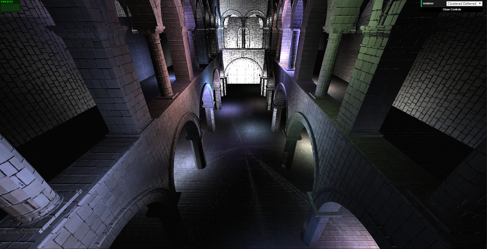
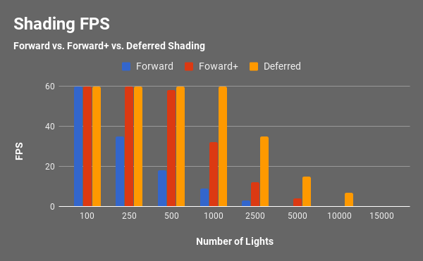
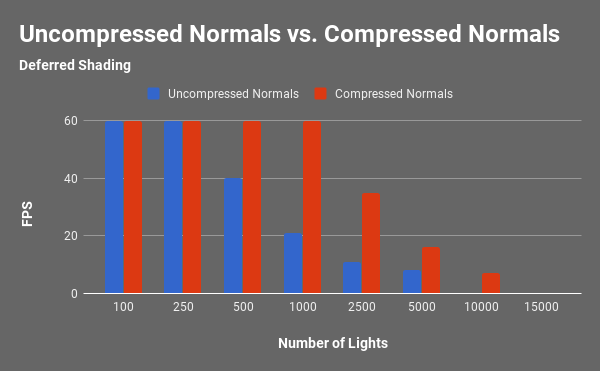

WebGL Clustered Deferred and Forward+ Shading
======================

**University of Pennsylvania, CIS 565: GPU Programming and Architecture, Project 5**

* Jonathan Lee
* Tested on: **Google Chrome 61.0.3163.100** on
  Windows 10, Xeon ES-1630 @ 3.70GHz 32GB, GTX 1070 24GB (SigLab)

# Overview

In this project, I was able to explore **Clustered Forward+ and Deferred Shading**. 

### Live Online

### Demo

# Clustered Forward+

# Clustered Deferred

### Blinn Shading

| 100 Shininess             | 200 Shininess              | 500 Shininess            | 
|---------------------------|----------------------------|--------------------------|
|   |    |  |  

| Without Blinn             | With Blinn                       | 
|---------------------------|----------------------------------|
|  |    |

# Analysis

## Forward vs. Forward+ vs. Deferred Shading

## Normal Compression in Deferred Shading

### Credits

* [Three.js](https://github.com/mrdoob/three.js) by [@mrdoob](https://github.com/mrdoob) and contributors
* [stats.js](https://github.com/mrdoob/stats.js) by [@mrdoob](https://github.com/mrdoob) and contributors
* [webgl-debug](https://github.com/KhronosGroup/WebGLDeveloperTools) by Khronos Group Inc.
* [glMatrix](https://github.com/toji/gl-matrix) by [@toji](https://github.com/toji) and contributors
* [minimal-gltf-loader](https://github.com/shrekshao/minimal-gltf-loader) by [@shrekshao](https://github.com/shrekshao)
