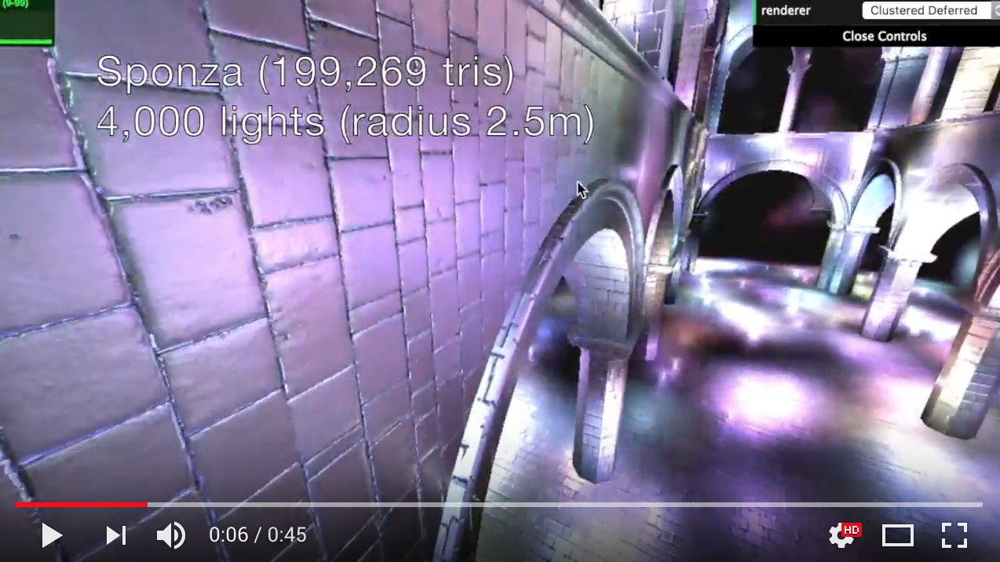

WebGL Clustered Deferred and Forward+ Shading
======================

### **University of Pennsylvania, CIS 565: GPU Programming and Architecture, Project 5**

* YAOYI BAI (pennkey: byaoyi)
* Tested on: Windows 10 Professional, i7-6700HQ  @2.60GHz 16GB, GTX 980M 8253MB (My own Dell Alienware R3)
* Browser: Google Chrome

### Live Online

### Demo Video/GIF

### (TODO: Your README)

*DO NOT* leave the README to the last minute! It is a crucial part of the
project, and we will not be able to grade you without a good README.

This assignment has a considerable amount of performance analysis compared
to implementation work. Complete the implementation early to leave time!

## **1. Clustered Forward+**

All the clusters are linearly divided in the camera space. Which means that the clusters are all trapezoids, or irregular "cubes". Therefore, the intersection test of those clusters are the most importance in the part. The way to implement this test is to do projection to four surfaces of the cluster, they are up, down, left and right surfaces. For near and far surface, we simply compare the z-value of the light we want to check and the near and far surface. 

To check for the intersection, there are few steps to do:

 1.  Calculate the z-value of the light lies on;
 2.  Calculate the width and height of the mini frustum slice, and divide them by the number of slices the frustum is divided;
 3.  Calculate the left top value of this cluster, and left bottom, right top and right bottom on the near plane;
 4.  Calculate the normals of left, right, top and bottom surfaces;
 5.  Calculate the projection of the vector from the camera to the light position in the camera space on the surface normals;
 6.  If the projection is larger than 0, check if the length of the projection is larger than the radius of the light, if it is true then the light lies outside the cluster, if not check for the next plane. 

After all those checking, we will write the light indexes that lies inside the cluster to the _clusterTexture buffer. 

## **2. Deferred Shading With Clusters**

The cluster mechanism of deferred shading are basically the same. The differences between forward+ and deffer shading are the gbuffers pass from vertex shader to fragment shader, which takes less processing time than forward+.

## **3. Blinn-Phong Shading** 

[Reference](https://en.wikipedia.org/wiki/Blinn%E2%80%93Phong_shading_model) from Wikipedia.

## **4. G-Buffer Optimization** 

The core idea here is to transfer from the normal coordinate system into *Polar coordinate system*, which means that we will only have to store the y-value of the normal and the angle of the projection of the normal on the x-o-z plane that rotated around y-axis from positive x-axis. Therefore, we can compact the data in two buggers:

    gl_FragData[0] = vec4(v_position[0],v_position[1],v_position[2],norm[1]);
    gl_FragData[1] = vec4(col[0],col[1],col[2],theta);
         

## **5. Performance Analysis** 

#### **Improvement Possibility:**

The result is actually pretty slow, and I think the reason for the clustered to be super slow would be:

 1.  Intersection checking method could be revised: like for each lights, we check for the planes that "covers" the area, and then loop through the "cover" planes. Then, there will be less slices to check and the checking would be far more faster;
 2. Use log arithmetics to divide the z slices. Because currently the linear division will result in all of the lights and geometries are located inside the z=0 slices, though we still needs to loop through all the clusters. Therefore, the loop of those z>=2 clusters are super wasting. Here inside this project, I terminated the loops that z>=3. Although this method is tricky, the project runs a lot more faster. 

#### **Performance Comparison:**

According to the graph above we can see that:

 1. When we compact the gbuffer, we will have great performance improvement especially when the light amount are relatively high;
 2. It is not absolute that deferred shading be faster than forward+.
 
 But still, there should be several ways for us to improve the performance of this project according to the analysis above.

### Credits

* [Three.js](https://github.com/mrdoob/three.js) by [@mrdoob](https://github.com/mrdoob) and contributors
* [stats.js](https://github.com/mrdoob/stats.js) by [@mrdoob](https://github.com/mrdoob) and contributors
* [webgl-debug](https://github.com/KhronosGroup/WebGLDeveloperTools) by Khronos Group Inc.
* [glMatrix](https://github.com/toji/gl-matrix) by [@toji](https://github.com/toji) and contributors
* [minimal-gltf-loader](https://github.com/shrekshao/minimal-gltf-loader) by [@shrekshao](https://github.com/shrekshao)
