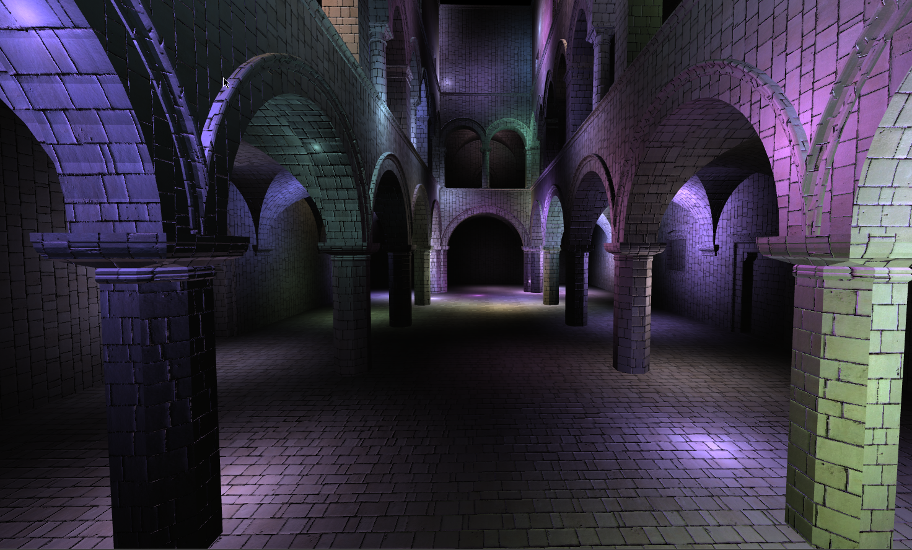
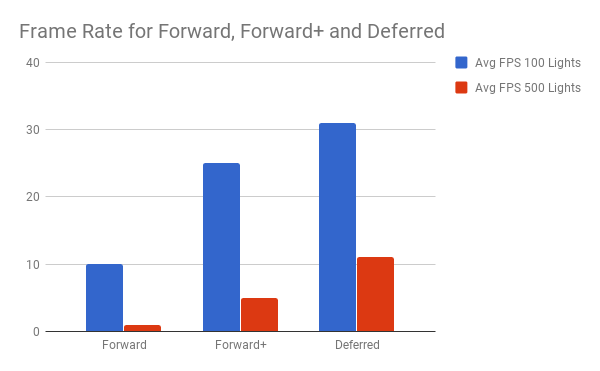
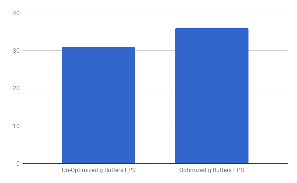
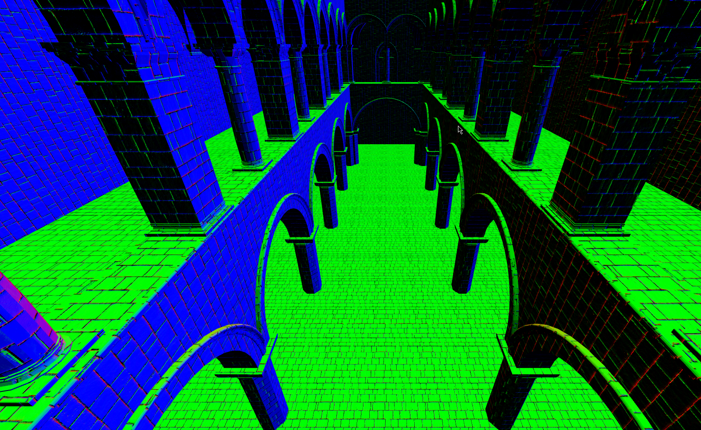
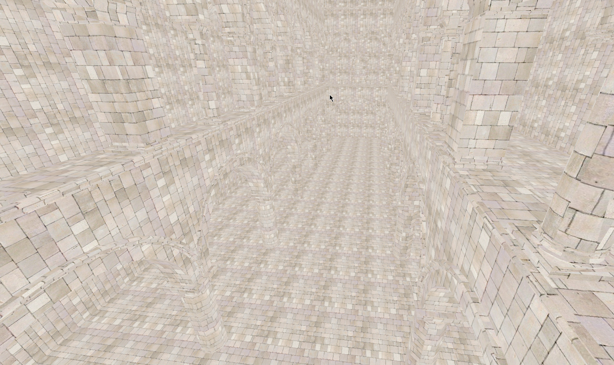

WebGL Clustered Deferred and Forward+ Shading
======================

**University of Pennsylvania, CIS 565: GPU Programming and Architecture, Project 5**

* Rudraksha Shah
* Tested on: **Google Chrome 62.0.3202.75** on
  Windows 10, i7-7700HQ @ 2.80GHz 16GB, GTX 1050 4096MB (Personal Computer)

### Live Online

### Demo Video/GIF

__Features:__

- Clustered Forward Plus

- Clustered Deferred with Blinn-Phong Shading

- Optimizations:

  - Use 2-component normals to reduce the g buffers needed          

__Project Overview:__

In this project I worked on implementing a clustered forward plus and a clustered deferred renderer.   

- Cluster: The view frustrum is divided into many segments along all three spatial dimensions each such segment is called a frustrum. These clusteres are used to bin the lights so that the frustrums are only shaded with the lights they contain. This helps us as inside the fragment shader we have to iterate over all the lights to find if each light is contained inside the frustrum which is a time consumig process and having the lights pre stored in a buffer makes this faster.

- The Forward Method: It is a naive method of sorts in which inside the fragment shader we iterate through all the lights for each frustrum and check if it containes the light to shade it.

- The Forward Plus Method: This method is similar to the Forward method but in this case we use the clustring to store lights in each fragments that is used to shade the fragments later.

- The Deferred Method: This method is similar to the Forward Plus or the Forward method but what we essentialy do is delay (deffer) the rendering process like a post shader. In this case we are doing a per pixel rendering in the later stage for only those fragments that are visible and are stored in the texture. This makes the rendering process faster and is useful for highly shading intensive tasks.

Performance Analysis
======================

## Forward vs Forward Plus vs Deffered

The test was conducted with 100 lights and 500 lights in the scene on the sponza model with debugging OFF.

As expected the forward method is the slowest and the Forward Plus and Deferred are in increasing order of speed. This trend is seen linearly and I hvae included a test with 500 lights as a representation.

The reason why forward is the slowest is obvious as it is the brute force method but the increase in the frame rate going from Forward Plus to Deferred is expected.

The primary reason for this increase is in the amount of work each pipeline Forward Plus and Deferred spends on shading. The Forward Plus pipeline shades all the clusters regardless if those clusters are going to be rendered finally or not. While Deferred pipeline spends time shading only those fragments that are going to be viewed. This is similar to back face culling where we do not render the back side and thus dont spend time rendeiring it.

## Deferred with g-Buffer Optimizations

The performance analysis is done with 100 ligts in the scene with the sponza model and debugging turned OFF

The g-buffers store vec4's which can be used to our advantage as we can instead of using three g-buffers for storing the norma, color and position we can use two by storing only two coordinats of the normal.

This gived usa performance gain obtained of 4-5 FPS by using 2 g-buffers instead of 3.

We can obtain this performance gain because we know that the normal will be somewhere along the z which is independent of the frustrum and using the knowledge that a normal is a unit vector we can re-construct the z in the fragment shader.

## Blinn-Phong Shading

## Screen Normals

## albedo

### Credits

* [Three.js](https://github.com/mrdoob/three.js) by [@mrdoob](https://github.com/mrdoob) and contributors
* [stats.js](https://github.com/mrdoob/stats.js) by [@mrdoob](https://github.com/mrdoob) and contributors
* [webgl-debug](https://github.com/KhronosGroup/WebGLDeveloperTools) by Khronos Group Inc.
* [glMatrix](https://github.com/toji/gl-matrix) by [@toji](https://github.com/toji) and contributors
* [minimal-gltf-loader](https://github.com/shrekshao/minimal-gltf-loader) by [@shrekshao](https://github.com/shrekshao)
