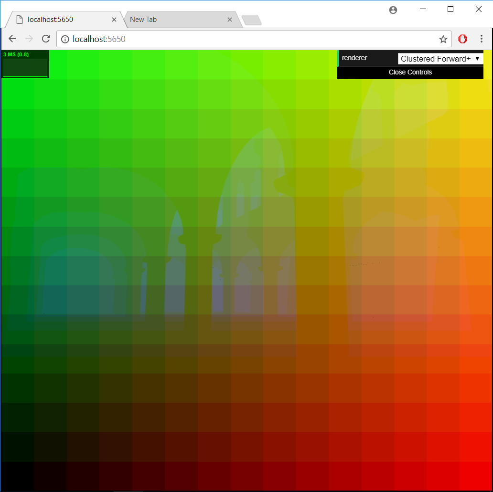
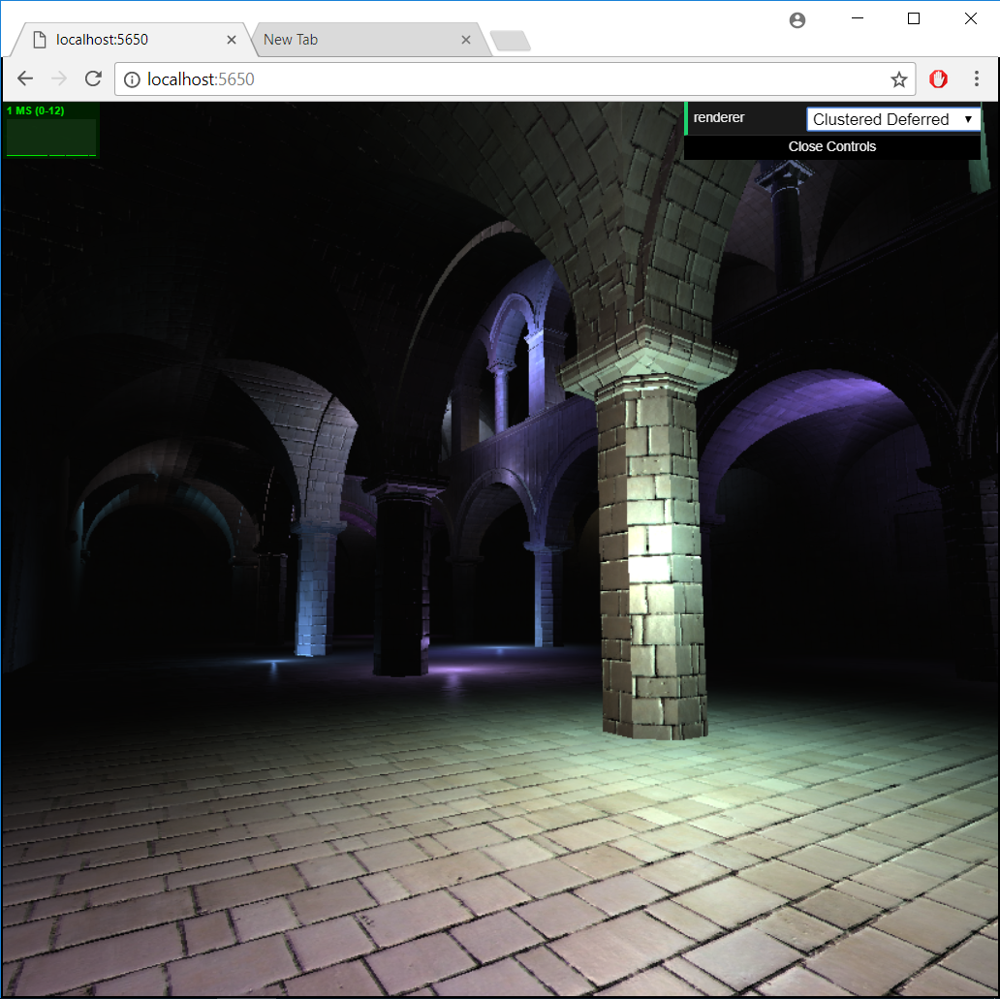

WebGL Clustered Deferred and Forward+ Shading
======================

**University of Pennsylvania, CIS 565: GPU Programming and Architecture, Project 5**

* Daniel McCann
* Tested on: Windows 10, i7-5700HQ CPU @ 2.70GHz, GeForce GTX 970M, 16 GB RAM

### Live Online

### Overview

This is a real-time WebGL rasterizer meant to show an effective way to handle many light sources.

There are three renderer modes: forward, clustered forward+ and clustered deferred. 
* Forward is the provided default and tries to shade every pixel with every light source.
* Clustered forward+ bins lights into "clusters" that occupy a block of the camera's viewing frustum. Each pixel is only shaded by lights that influence their enclosing cluster.
* Clustered deferred uses the same optimization, but does lighting calculations from gbuffer data: instead of shading models as they occupy pixels, shading-relevant information is handed over to textures called gbuffers instead, which are then used for shading after all models are done. This means that if a pixel is overwritten by a closer model, the work to replace it is inexpensive compared to lighting.

### Features

## Quick Frustum Clusters and Culling

This clustering algorithm is constant time for each light. To find a cluster for any point, you find the frustum plane perpendicular to the view through the point. The x and y side lengths of this plane are proportional to the distance. Now you can get a normalized term for percentage across the x and y of this plane and the z of the frustum. For a light with a sphere radius of influence, you test the min and max x, y and z on the sphere, creating bounds for frustum clusters. This can also cull all lights outside of the viewing cluster.

Above: each pixel is shaded according to the cluster it belongs to. X is red, Y is green, Z is blue. You can see the outline of the pillars where it becomes more blue.

## Blinn Shading

This uses a simple blinn shader for all lights.

## Deferred Renderer

Since this is a blinn shader with no specular texture, only 8 channels are needed for the gBuffer. (position: 3, color: 3, normal: 2). The normals fit into two channels with octahedron encoding, which was used at my internship last summer. Therefore only two gBuffers are needed, minimizing memory costs.

### Performance

Here is the range of times, in ms for each method with a different number of lights:

| Lights | 100 | 200 | 500 |
| --- | --- | --- | --- |
| Forward | 67-83 | 125-143 | 333-500 |
| Forward+ | 22-30 | 40-50 | 111-125 |
| Deferred | 16-19 | 21-23 | 34-40 |

Deferred is obviously the superior method. Even given the work of decoding the normals and fetching from buffers, it could render more than twice the speed of forward+. This is because it only has to light the closest fragment in each pixel, instead of repeatedly lighting fragments.

### Credits

* [Three.js](https://github.com/mrdoob/three.js) by [@mrdoob](https://github.com/mrdoob) and contributors
* [stats.js](https://github.com/mrdoob/stats.js) by [@mrdoob](https://github.com/mrdoob) and contributors
* [webgl-debug](https://github.com/KhronosGroup/WebGLDeveloperTools) by Khronos Group Inc.
* [glMatrix](https://github.com/toji/gl-matrix) by [@toji](https://github.com/toji) and contributors
* [minimal-gltf-loader](https://github.com/shrekshao/minimal-gltf-loader) by [@shrekshao](https://github.com/shrekshao)
* [Normal compression algorithm](https://knarkowicz.wordpress.com/2014/04/16/octahedron-normal-vector-encoding/)
