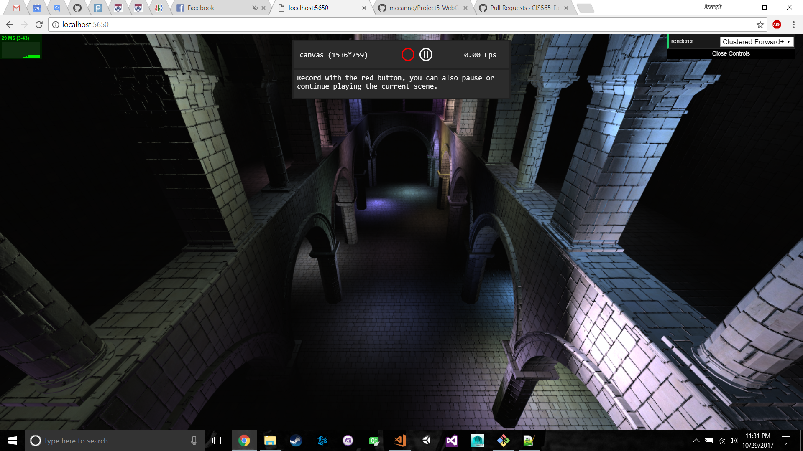

WebGL Clustered Deferred and Forward+ Shading
======================

**University of Pennsylvania, CIS 565: GPU Programming and Architecture, Project 5**

* Joseph Klinger
* Tested on: Windows 10, i5-7300HQ (4 CPUs) @ ~2.50GHz, GTX 1050 6030MB (Personal Machine)

### Live Online

[Demo.]http://klingerj.github.io/Project5B-WebGL-Deferred-Shading)

### Demo Video/GIF

[]

### README

This week, I worked on implementing a clustered Forward+ and clustered deferred renderer. A quick rundown on how those rendering methods work:

Forward: simply, render each material with each light, using a nested pair of for loops. Not the most efficient way to do things.

Clustered Forward+: Only render each material with each light that is close enough to influence the object.

Clustered Deferred: Render geometry attributes to G-buffers, apply shading during a second pass, in screen space using the G-buffers. Also uses clusters to only compute lighting for nearby lights.

### Credits

* [Three.js](https://github.com/mrdoob/three.js) by [@mrdoob](https://github.com/mrdoob) and contributors
* [stats.js](https://github.com/mrdoob/stats.js) by [@mrdoob](https://github.com/mrdoob) and contributors
* [webgl-debug](https://github.com/KhronosGroup/WebGLDeveloperTools) by Khronos Group Inc.
* [glMatrix](https://github.com/toji/gl-matrix) by [@toji](https://github.com/toji) and contributors
* [minimal-gltf-loader](https://github.com/shrekshao/minimal-gltf-loader) by [@shrekshao](https://github.com/shrekshao)
