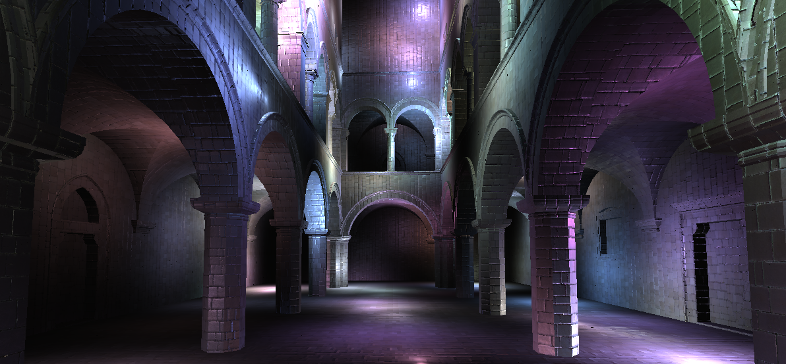
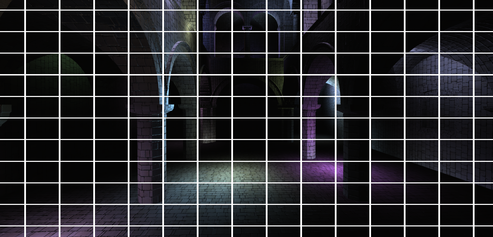
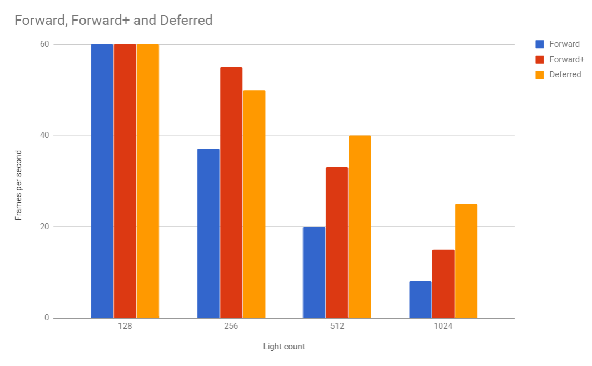

WebGL Clustered Deferred and Forward+ Shading
======================

**University of Pennsylvania, CIS 565: GPU Programming and Architecture, Project 5**

* Mariano Merchante
* Tested on
  * Microsoft Windows 10 Pro
  * Intel(R) Core(TM) i7-6700HQ CPU @ 2.60GHz, 2601 Mhz, 4 Core(s), 8 Logical Processor(s)
  * 32.0 GB RAM
  * NVIDIA GeForce GTX 1070 (mobile version)
  * Chrome Version 61.0.3163.100 (Official Build) (64-bit)

### Live Online

### Demo Video/GIF

A video can be found [here](https://vimeo.com/240225834)

## Details

This project implements both a forward+ and a clustered deferred rendering pipeline. The clustering is done in frustum space, by using the lights' bounding volumes to find the intersecting cluster cells.

It also implements a simple Phong shader in the deferred pipeline.

There's no optimization regarding light spheres and cluster collision, so there is a lot of unnecesary iterations -- this is the main probable reason for the following performance results:

Although different grid sizes may improve these results, the lack of intersection refinement makes each pipeline very iteration dependent, making the advantage that deferred rendering has over forward+ infinitesimal compared to the amount of iterations per pixel.

## G Buffer description

The deferred renderer uses only two buffers:

G1: [albedo | depth]

G2: [NormalXY | specularValue | specularExponent]

In the accumulation pass, the view space position is reconstructed from the depth, and the normal is also rebuilt from the encoded XY values. Initially, the texture format was RGBA8 but because of precision issues I reverted to FLOAT. Ideally, buffers should be RGBA8 and depth should be encoded in all four components of a separate buffer.

## Known issues

- There's an indexing bug that sometimes interferes with the cluster selection. It seems to be an off-by-one error.

### Credits

* [Three.js](https://github.com/mrdoob/three.js) by [@mrdoob](https://github.com/mrdoob) and contributors
* [stats.js](https://github.com/mrdoob/stats.js) by [@mrdoob](https://github.com/mrdoob) and contributors
* [webgl-debug](https://github.com/KhronosGroup/WebGLDeveloperTools) by Khronos Group Inc.
* [glMatrix](https://github.com/toji/gl-matrix) by [@toji](https://github.com/toji) and contributors
* [minimal-gltf-loader](https://github.com/shrekshao/minimal-gltf-loader) by [@shrekshao](https://github.com/shrekshao)
