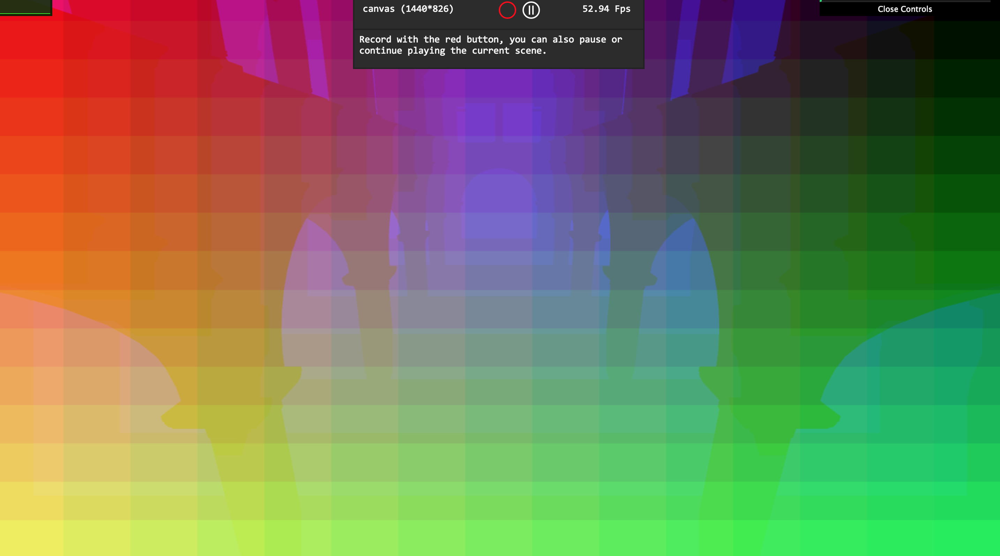
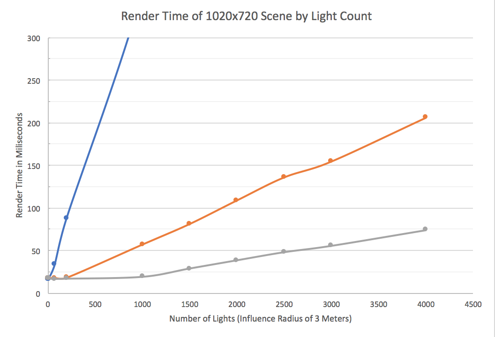

WebGL Clustered Deferred and Forward+ Shading
======================
**An in-browser demonstration of the advantages of two modern rendering paradigms: clustering and deferred shading.**
**University of Pennsylvania, CIS 565: GPU Programming and Architecture, Project 5**

* Daniel Daley-Mongtomery
* Tested on: Google Chrome v62.0.3202.94
  MacBook Pro, OSX 10.12, i7 @ 2.3GHz, 16GB RAM, GT 750M 2048MB (Personal Machine)

### Live Online

[](https://illdivino.github.io/Project5-WebGL-Clustered-Deferred-Forward-Plus/)

### Demo Video/GIF

[](https://www.youtube.com/watch?v=9cHoAc6pyD4)

### Motivation
A basic forward shading system works as follows:
```
for every fragment {
  for every light {
    shade(fragment, light);
  }
}
```
  This results in a serious cost for every light added, even if that light only affects one pixel of the final image. The goal of this project is to devise a means of reducing lights' impact on realtime rendering by clustering the lights into areas of influence and by preventing per-light shading work on fragments that don't make it to the frame buffer. To this effect I've implemented the following features:
* Viewspace Light Clustering on the CPU
* Clustered Forward+ Rendering
* Deferred Rendering
* Blinn-Phong shading
* Dynamic and Logarithmic Z-Division for Cluster Generation
* 2-Component Normals for Reduced GBuffer Size

### Clustering
  On every frame the renderer iterates through every light on the CPU, processing its radius and position in view space to determine which parts of the camera frustum (clusters) it can influence. With this information, it updates WebGL texture, filling each column with a cluster's number of relevant lights and the index of each light.
```
              Column 0               Column 1
        _________________________________________________      
Row 0  | Cluster 0 numLights  | Cluster 1 numLights |
       | first light index    | first light index   |
       | second light index   | second light index  |     ...
       | third light index    | third light index   |
       |----------------------|---------------------|----
Row 1  | fourth light index   | fourth light index  |
       | fifth light index    | fifth light index   |
       |        ...           |        ...          |
```
  These indices refer to another texture packed with the lights' data, and are stored this way so as to be read by the fragment shader later on. The cluster volumes are, most simply, linear divisions of the screen and camera depth. Below is a render the clusters used for most of this project, with 15 divisions in each dimension. Each pixel's R,G, and B channels are mapped to their X, Y, and Z cluster index respectively:



### Clustered Forward+ Rendering
  While not strictly identical to the the [original idea](https://takahiroharada.files.wordpress.com/2015/04/forward_plus.pdf), my version of Forward+ makes use of the above clusters to prevent fragments from computing contributions from irrelevant lights. In all, the process looks a something like this:
```
for each fragment {

  cluster = determineCluster(fragment.position);
  relevantLights = getLights(cluster);
  
  for each light in relevantLights {
    shade(fragment, light);
  }
}
```
  While the relationship between geometry and lighting is still nested, we've decreased the marginal cost of a light. If we consider a 15x15x15 cluster setup and a light radius straddling **27** clusters, there could be as low as a **27 / (15\*15\*15) = 0.8%** chance that an added light will increase the cost of rendering any given fragment. To further illustrate, the rendering below displays the number of lights influencing each cluster in the green channel, and the z cluster index in red. In the shot below, red fragments are performing zero lighting calculations. In a basic forward renderer, each would perform 75!


### Clustered Deferred Rendering

  Deferred rendering makes use of two passes to decouple the nested relationship between geometry and lights. In the first pass, every fragment is checked and, if it passes a depth test, sends all necessary shading information to a geometry buffer (g-buffer) texture. In a scene with 3,000 lights, a forward renderer would perform many, many lighting calculations even for fragments that don't reach the frame buffer; a deferred renderer will eliminate these fragments before any lighting is done.
  
  After this it can be guaranteed that every fragment that reaches the second pass will become a pixel. To get the necessary data for a shading, the second pass can read the g-buffer, determine the cluster, then compute lighting as usual.
  
```
for each fragment {
  gbuffer.write(position, normal, albedo);
}

for each pixel {
  gbuffer.read(position, normal, albedo);
  
  cluster = determineCluster(fragment.viewPosition);
  relevantLights = getLights(cluster);
  
  for each light in relevantLights {
    shade(fragment, light);
  }
}
```

  This efficient dismissal of non-important fragments comes at a cost: deferred rendering has difficulty rendering transparent materials. For scenes with few such materials, it's sometimes useful to render everything deffered, *then* render transparent materials forward. For this project's test scene, there were no such materials. You can see a breakdown of my g-buffer composition below:


### Performance

##### Baseline

  The intended benefit from clustering and deferring is to allow for more lights, so the most important test is whether the benefits are worth all the math we've introduced per frame. Below is a performance comparison for each rendering technique as lights are added. The clustered renderers are using a blinn-phong shader while the forward is using lambert, so the comparison is even more overwhelming than it appears below:



  In the time it takes for a basic forward shader to render a ~150 light scene, Forward+ can handle ~1500 lights, and Clustered Deferred can handle 4000! While it's admittedly unlikely that a scene will require that many dynamic lights, the results are very promising with even the most naive z-division and g-buffer setups. Before we push it any further, you might think that in anything with more than a dozen lights, clustered systems are superior. One caveat:


  The more lights overlap, the less benefit we get from clustering. As the volume of the light approaches the domain volume of the camera frustum, the clustering math just becomes an added, wasted cost. But assuming we've got a scene suited to a clustered renderer, let's see where we can improve.

##### Z Division

  A camera's view frustum typically has a generous far clip, in our example 1000 meters. If we were to simply divide this equally based on distance, every light in our Sponza example scene would fall into z cluster 0! While we could hard-code a scaling factor to encompass the expected range of lights the camera sees, we could simply cluster according to the nearest and farthest lights of the previous frame to get a more even distribution, so long as the shaders recieve this range every frame.
  
  Speaking of a more even distribution, I imagined I could theoretically make the z division more even by accounting for the widening x and y tile size as distance increased. Like [Avalanche](http://www.humus.name/Articles/PracticalClusteredShading.pdf), I wanted to divide z space exponentially so closer, commonly-struck pixels can be more specifically clustered while farther, less-commonly struck pixels would be more coarsely divided.
  


  
  The dynamic range was, quite unsurprisingly, more successful and versatile than any hard-coded approximate value. The logarithmic division was less promising. One possible reason could be that the now even bigger far-clusters created fragments with a large light count that, if executed along with a fragment of lower light count (as is very possible in this close indoor scene), resulted in asymetric execution time (divergence) and worse GPU utilization. Combined with the extra math needed for every light and fragment, my attempts were unfortunately as likely to slow each renderer as accelerate it. Below are the render times at 4000 3.0-radius lights from at the starting camera position:
  


One future idea for reducing the burden of log() math would be to generate a values from 0-1.0 at runtime for every z cluster, and to simply multiply them by my dynamically calculated far range every frame to determine cluster boundaries. 

##### G Buffer Size

  The last improvement made to the renderer is the compression of the g-buffer. The more quality you want from a deferred system, the more information must be sent from the first pass to the second. This results in a lot of memory cost, but can be mitigated by using every single bit. My choice for this compression was to store world-space normals according to the [octahedral projection method](http://jcgt.org/published/0003/02/01/paper.pdf) found [here](https://www.panda3d.org/forums/viewtopic.php?f=8&t=18454). The two-component encoding was placed in the alpha channel of my world position and albedo vectors, and decoded with negligible error.
  


  The improvement at 4000 lights was't life-changing, but represented a big improvement when CPU clustering is reported to be taking 31ms per frame anyway.
  


### Credits

* [Three.js](https://github.com/mrdoob/three.js) by [@mrdoob](https://github.com/mrdoob) and contributors
* [stats.js](https://github.com/mrdoob/stats.js) by [@mrdoob](https://github.com/mrdoob) and contributors
* [webgl-debug](https://github.com/KhronosGroup/WebGLDeveloperTools) by Khronos Group Inc.
* [glMatrix](https://github.com/toji/gl-matrix) by [@toji](https://github.com/toji) and contributors
* [minimal-gltf-loader](https://github.com/shrekshao/minimal-gltf-loader) by [@shrekshao](https://github.com/shrekshao)
