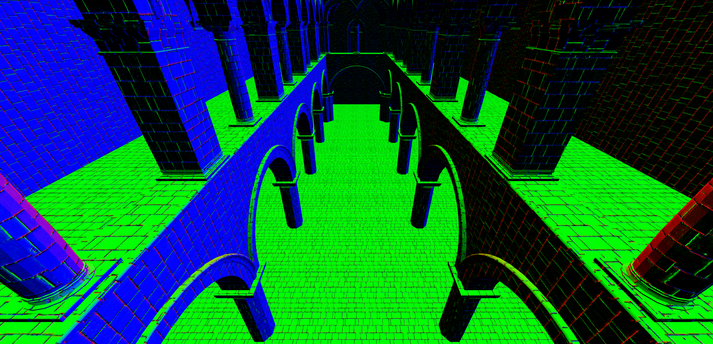

WebGL Clustered Deferred and Forward+ Shading
======================

**University of Pennsylvania, CIS 565: GPU Programming and Architecture, Project 5**

* Wenli Zhao
* Tested on: **Google Chrome**
  Mac OS X El Capitan 10.11.6 , 2.6 GHz Intel Core i5, Intel Iris 1536 MB

### Live Online

Coming soon. I will put this online when I work out some bugs!

### Demo Video/GIF

Also coming soon. In the meantime, here is an image of a slightly buggy clustered forward+ renderer:

### ReadMe
The goal of this project was to implement a clustered forward + and clustered deferred renderer.
I implemented both the clustered forward+ and the clustered deferred renderer with blinn phong shading. However, I was not able to properly debug the clustered forward+, which is why the images of tile-outlines. Additionally, after adding the blinn-phong shading to the clustered deferred, it stopped working. So to demonstrate that I properly implemented the shading, I included a screenshot of the blinn-phong shading applied to clustered forward+.

### Analysis

After 500 lights, the normal forward rendering stopped running on my machine.

### Debug views

### Credits

* [Three.js](https://github.com/mrdoob/three.js) by [@mrdoob](https://github.com/mrdoob) and contributors
* [stats.js](https://github.com/mrdoob/stats.js) by [@mrdoob](https://github.com/mrdoob) and contributors
* [webgl-debug](https://github.com/KhronosGroup/WebGLDeveloperTools) by Khronos Group Inc.
* [glMatrix](https://github.com/toji/gl-matrix) by [@toji](https://github.com/toji) and contributors
* [minimal-gltf-loader](https://github.com/shrekshao/minimal-gltf-loader) by [@shrekshao](https://github.com/shrekshao)
