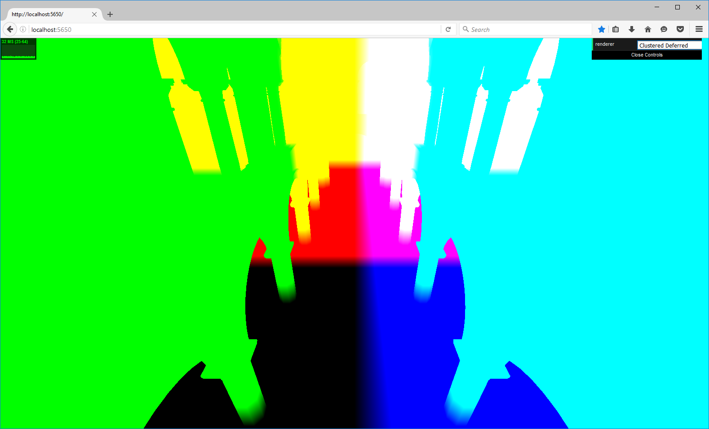

WebGL Clustered Deferred and Forward+ Shading
======================

**University of Pennsylvania, CIS 565: GPU Programming and Architecture, Project 5**

* Byumjin Kim
* Tested on: **Firefox 47.0.2**
  Windows 10, i7-6700HQ @ 2.60GHz 15.89GB GTX 1060 (mobile)

### Overview

In this project, I have used WebGL to implement Clustered Forward+ and Clustered Deferred renderer.

#### Clustered Forward + Rendering & Clustered deferred Rendering

#### Lensflare Effect

### Complete requirements

- Basic Features
	- Clustered Forward+
	- Clustered Deferred
	- Blinn-Phong shading
	- Optimizations using two G- buffers (use total 6 channels)
		- Use 2-component normals
		- Reconstructing world space position
		- Use a screen-filling triangular instead of using quadrilateral

- Additional Features
	- Lensflare with Bloom using post-process Gaussian blur

#### Clustered Forward+

Build a data structure to keep track of how many lights are in each cluster and what their indices are.
Then, render the scene using only the lights that overlap a given cluster

I refered the Avalanche slides' solution for slicing frustum (Speacial Near).

#### Clustered Deferred

Reuse clustering logic from Clustered Forward+.
Store vertex attributes in g-buffers.
Read g-buffers in a shader to produce final output.

I used two G-buffers of which structure like below.

 

Instead of making vertex position G-buffer, reconstructing world space position with depth can prevent the artifact which happens on the area of screen where nothing be drawn.
And, also it can save two channels.

|  albedo | normal | position | depth | 
| ----------- | ----------- | ----------- | ----------- |
|  |  |  |  |

And, using a screen-filling triangular instead of using quadrilateral reduces overload of rendering.
I used this only for one post-processing (Lensflare). But, the more post processes be used, the better rendering performance can be gotten.

 

#### Lensflare effect

Lens flare refers to a phenomenon wherein light is scattered or flared in a lens system, often in response to a bright light, producing an undesirable effect on the image.
In order to create this effect, I referred to John chapman’s Lens flare which is not physically-based model. Of course, Physically-based Lens flare can generate more accurate effects but it is much expensive. To do this, it needs several independent effects ghosts, halo, diffraction created by very bright Scene color. And, at the final stage, composite the all effects with dirtmask texture and star burst texture. (below images are designed by me.)

|  Dirt Mask Texture | Star Burst Texture | 
| ----------- | ----------- |
|  |  |

### Performance Analysis

#### Forward vs Clustered Forward+ vs Clustered Deferred

Resolution		  : 960 x 540
Number of Lights  : 2500
Light's radius	  : 3.0
Cluster Dimension : 16 x 16 x 16  

 

|   | Forward | Clustered Forward+ | Clustered Deferred | 
| ----------- | ----------- | ----------- | ----------- |
| ms | 125ms | 34ms | 33ms |

Resolution		  : 1920 x 1080
Number of Lights  : 2500
Light's radius	  : 3.0
Cluster Dimension : 16 x 16 x 16  

 

|   | Forward | Clustered Forward+ | Clustered Deferred | 
| ----------- | ----------- | ----------- | ----------- |
| ms | 333ms | 66ms | 32ms |

The efficient of deferred rendering increases when the scene is drawn on larger screen space.

#### 2 Compacted G-buffer vs 4 G-buffer

Resolution		  : 1920 x 1080
Number of Lights  : 2500
Light's radius	  : 3.0
Cluster Dimension : 16 x 16 x 16  

 

As we can see, the difference of performance between former and later is really tiny.
I think the time of fetching texels from g-buffers is similar to the time consumed by additional shader codes such as Reconstructing world space position and normal.
But, obviously, in terms of memory, using 2 Compacted G-buffer can save the memory equivalent to 2 G-buffer textures.

#### Quadrilateral vs Triangular Screen filling

Resolution		  : 1920 x 1080
Number of Lights  : 2500
Light's radius	  : 3.0
Cluster Dimension : 16 x 16 x 16 
RenderMode		  : Clustered Deferred Effect

 

### Credits

* [Three.js](https://github.com/mrdoob/three.js) by [@mrdoob](https://github.com/mrdoob) and contributors
* [stats.js](https://github.com/mrdoob/stats.js) by [@mrdoob](https://github.com/mrdoob) and contributors
* [webgl-debug](https://github.com/KhronosGroup/WebGLDeveloperTools) by Khronos Group Inc.
* [glMatrix](https://github.com/toji/gl-matrix) by [@toji](https://github.com/toji) and contributors
* [minimal-gltf-loader](https://github.com/shrekshao/minimal-gltf-loader) by [@shrekshao](https://github.com/shrekshao)
