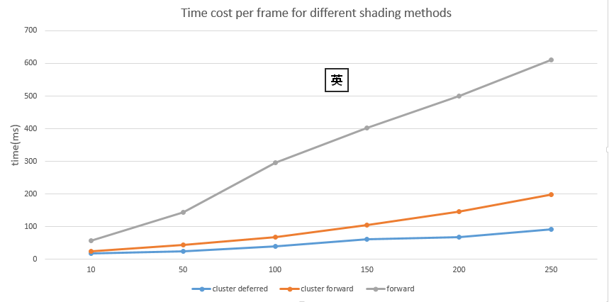
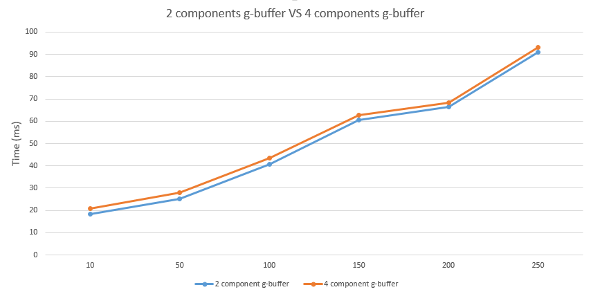

WebGL Clustered Deferred and Forward+ Shading
======================

**University of Pennsylvania, CIS 565: GPU Programming and Architecture, Project 5**

* Yi Guo
* Tested on:  Windows 8.1, Intel(R) Core(TM)i5-4200M CPU @ 2.50GHz 8GB, NVIDIA GeForce 840M (Personal Notebook)

### Description
In this project, I implement the cluster forward shader and cluster deferred shader to render a scene with hundreds of moving lights. For the cluster deferred shading, the objects are rendered based on Blinn-Phong model. Also, I compress the data structure that passed into the g-buffer and normals are presented using only 2 componets. All rendering processes are based on WebGl and rendering results can be shown online.

### Demo Video

click [here](https://vimeo.com/240100889) to see the demo video.

### Screen shot
* **Rendering result**


* **Debug view**

<table class="image">
<tr>
	<td>Normal </td>
	<td>Albedo </td>
</tr>
<tr>
	<td></td>
	<td></td>
</tr>
</table>

<table class="image">
<tr>
	<td>position </td>
	<td>U coordinates for cluster buffer texture </td>
</tr>
<tr>
	<td></td>
	<td></td>
</tr>
</table>


### Performance Analysis.

#### General Description of methods

* ***Forward Shading and Cluster Forward Shading***

For a scene with hundreds of lights, the brute force way to render the scene is to compute the shading of each geometry with each light. However, this method is too time costy. Since not all the geometries can be lightened by each light, we can filter out the lights that don't affect the current geometry. To do this efficiently, we divid the camera frustrum into grids and for each grid, we compute which light influence it and save the light indices into a buffer. Then, in the fragment shader, we only need to compute the shading of each geometry in the grid with the lights we saved in the buffer, which dramatically decrease the number of light we need to deal with for each geometry. 

Note: Here I divide the frustrum equally in each direction and other division strategies should also work. 


* ***Cluster Deferred shading***

For the method above, we can continue optimizing it. In the traditional OpenGL or WebGL rendering pipeline, all the geomtries will be shaded in the fragment shader, whether it can be seen or not. Since in most cases we only one or a few light sources in the scene(like sun), this method works well and since we compute and save shading result at different depth, we can easily create many special visual effect like transparency, blending and so on.  But for the scene with hundreds of lights, the performance of this method is not ideal. For each light, we need to unnecessarily compute the shading  
for blocked geometries and when there are huge number of lights, the overall time costy will be extremely large. So instead, we use deferred shading, which means we only want to shade the geometry that we can see for each light.

To do this, in the fragment shader, instead of computing the light shading, we package the data we want and output it into the frame buffer. The frame buffer here will automatically hold the fragment data of the geometry with the least depth in each pixel. And then we can use the filtered data(g-buffer) to finish the light shading. 

<table class="image">
<tr>
	<td>forward pipeline </td>
	<td>deferred pipeline </td>
</tr>
<tr>
	<td></td>
	<td></td>
</tr>
</table>

#### Analysis

* ***Efficiency discussion***

For the three different methods, forward shading, cluster forward shading and cluster deferred shading, I made a plot to compare this rendering efficiency.



As we can see, when the number of the lights in the scene is relatively small, the performance of 3 methods are close to each other. However, as the number of lights increases, the cluster strategy is much more efficient than brute force strategy and deferred shading is obviously much more faster than forward shading.

The cluster strategy and deferred shading essentially decrease the times we need to compute the light shadings to improve the efficiency. However, they also have the drawbacks. For the cluster strategy, we need to update the light information for each cluster in each frame. The influence is not obvious when the number of light is huge, but for the scenes with only a few lights this may hurt the overall performance. For the deferred shading, since we pass a data package(g-buffer) to the framebuffer instead of a single value or vec3, the memory cost will be much larger. We will talk about how to optimize this in the next part.

* ***Data compression for g-buffer***

Generally speaking, we need world space position, camera space position, normal, color, and depth for 
light shading. However, since framebuffer will automatically deal with the depth for us and camera space position can be computed through world space postion and camera view matrix, we actually only need to package 3 componets into g-buffer.

* ***2 Component normal***

To continue compress the data structure, we can use 2 componets the describe a normal. Since we know that normals are unit vectors, as long as we know 2 component of them, the third one can be computed.To do this, we need to use spherical coordinates, which mean for normal(x,y,z):

```
x=r*cos(phi)*cos(theta)
y=r*cos(phi)*sin(theta)
z=r*sin(phi)
```

where r equals to one here.

In this way, we can use 2 angle phi and theta to present a normal. Since we save the color and world position as vec4 and the fourth components are useless to us, we save phi and theta as the fourth component of these 2 vector. So eventually, we need to package 2 vec4s into g-buffer.

Here is comparsion for the efficiency before and after g-buffer data compression.



As we can see, efficiency does not change a lot. However, data compression for g-buffer is necessary. The highlight of doing this is to optimize the memory allocation instead of acceleration. The benefit of this is not obvious for this scene, but when the scene become larger and more complex, this method can save a lot of memory for us.

### Credits

* [Three.js](https://github.com/mrdoob/three.js) by [@mrdoob](https://github.com/mrdoob) and contributors
* [stats.js](https://github.com/mrdoob/stats.js) by [@mrdoob](https://github.com/mrdoob) and contributors
* [webgl-debug](https://github.com/KhronosGroup/WebGLDeveloperTools) by Khronos Group Inc.
* [glMatrix](https://github.com/toji/gl-matrix) by [@toji](https://github.com/toji) and contributors
* [minimal-gltf-loader](https://github.com/shrekshao/minimal-gltf-loader) by [@shrekshao](https://github.com/shrekshao)
