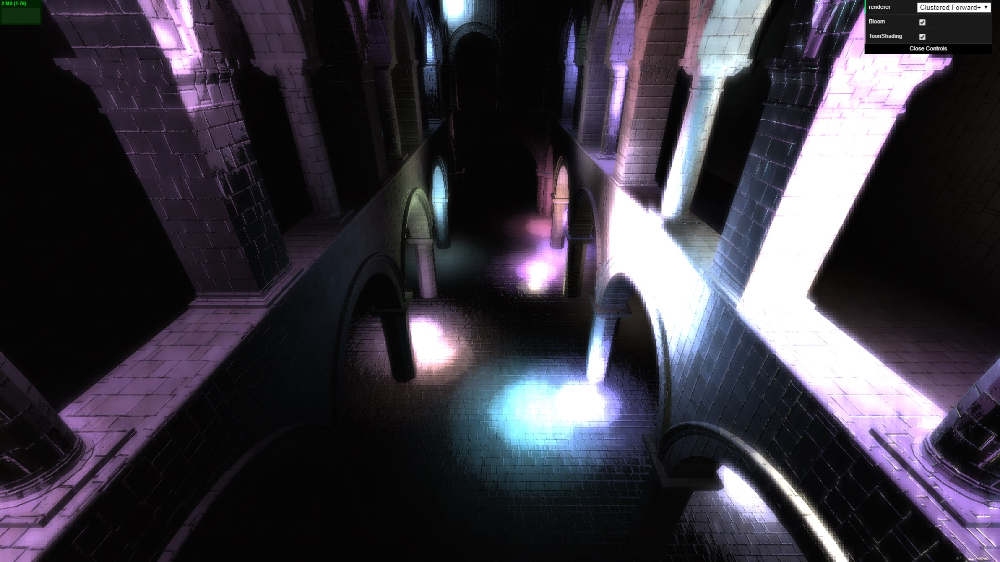
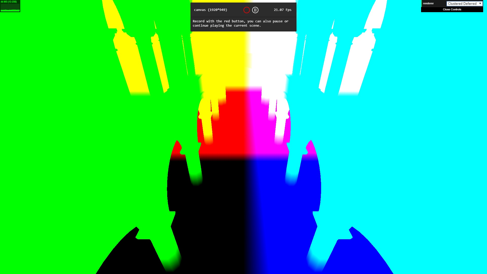
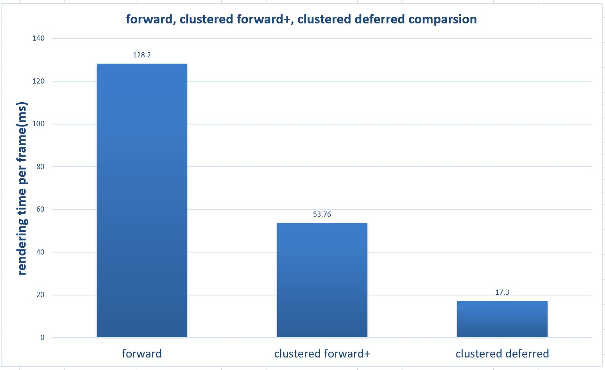

WebGL Clustered Deferred and Forward+ Shading
======================

**University of Pennsylvania, CIS 565: GPU Programming and Architecture, Project 5**

* Hanming Zhang
* Tested on: **Google Chrome 62.0** on
  Windows 10 Education, i7-3630QM @ 2.40GHz, 16GB, GTX 670MX 3072MB (Personal laptop)

### Live Online

[Live Deom Link](https://HanmingZhang.github.io/Project5-WebGL-Clustered-Deferred-Forward-Plus/)

### Demo Video/GIF

Project Features
================

### Screenshots:
 |  
------------ | -------------
no post processing | bloom
 |  
ramp shading | bloom + ramping shading

### Clustered Forward+
  - cluster data structure to keep track of how many lights are in each cluster and what their indices are
  - Render the scene using only the lights that overlap a given cluster

### Clustered Deferred
  - cluster part are the same as Clustered Forward+
  - Store vertex attributes in g-buffer
  - Read g-buffer in a shader to produce final output
  - Two g-buffers are used(two-component normal and reconstruct position using screen space X, Y, and depth information)

### Effects
- Bloom (additional pipeline stages include brightness filter, horizontal & vertical Gaussian blur and finally combine)
- Ramp shading

### Controls :
 - Left mouse button to rotate Camera
 - Right mouse button to move Camera
 - Middle mouse button to zoom in/out

### Project Analysis
#### All analysis happens on a 1024x768 canvas and 500 lights are in our sponza scene.

- #### Clustered Deferred Optimization

Before optimization, 4 g-buffers are used, which are albedo, normal, depth and position respectively and they are shown like below.

 |  
------------ | -------------
color / albedo | normal
 |  
depth | position

  After optimization, 2 g-buffers are used, which are albedo, view space depth(to determine fragment cluster depth index, because I slice clusters in view space), two component normal(X, Y) and NDC depth(to reconstruct position with screen space position). The structure is shown as below.

   

   ##### Performance Comparison

   

   ##### Analysis:
   As we can see, when the size of g-buffers reduces from 4 to 2, we have around 16% performance increase. During the process of rendering, we only need to write information to 2 frames buffers, and also only need to extract information from these 2 buffers. The bandwidth burden is reduced.

- #### Forward, Clustered Forward and Clustered Deferred Comparison

  

  ##### Analysis:
  Since forward will check every light in the scene in the fragment shader, so naturally, it takes the most time. Clusters works well, and we gain huge performance increase by using it, although on the CPU side, we need to loop through every light and assign their index to the influenced clusters.

  About cluster slice method I use (all slices happens on the view space):
  1. slice view space depth(between near and far clips) in a natural logarithm way, which means cluster size will smaller(in depth) when it's near and larger when it's far.
  2. evenly slice view frustum in X and Y directly (which means evenly slice our screen)
  finally, our view frustum should looks like this,
  

  As a result, we only shade limited amount of lights, which influences the cluster each fragment belongs to in fragment shader. This saves a lot of rendering time.
  In terms of clustered deferred shading, since we only save visible(nearer to camera and not occluded) fragments' information(color, normal, depth) to g-buffers, we save the time to render those not visible fragments.

- #### Bloom & ramp shading performance analysis

 

  ##### Analysis:
  Basically, Bloom post processing effect take additional stages to do brightness filter, horizontal Gaussian blur, vertical Gaussian blur and finally combine it with origin no effect frame. But in our case, it does not take so long time to do all these things, since all these actions are very basic, and just reading and writing frame buffers again and again. Several results during these stages are shown below.

 |   | 
------------ | ------------- | -------------
after brightness filter | after horizontal Gaussian Blur | after vertical Gaussian Blur  

  Ramp shading is almost the same as no effect rendering in terms of performance, and we only do several extra steps to modulate the diffuse coefficient(lambert term) in fragment shader.

### Credits

* [OpenGL Bloom Tutorial](http://prideout.net/archive/bloom/index.php) by Philip Rideout
* [OpenGL Bloom Effects](https://www.youtube.com/watch?v=LyoSSoYyfVU) by ThinMatrix
* Clustered Deferred and Forward Shading, Olsson et.al. 2012
* [Three.js](https://github.com/mrdoob/three.js) by [@mrdoob](https://github.com/mrdoob) and contributors
* [stats.js](https://github.com/mrdoob/stats.js) by [@mrdoob](https://github.com/mrdoob) and contributors
* [webgl-debug](https://github.com/KhronosGroup/WebGLDeveloperTools) by Khronos Group Inc.
* [glMatrix](https://github.com/toji/gl-matrix) by [@toji](https://github.com/toji) and contributors
* [minimal-gltf-loader](https://github.com/shrekshao/minimal-gltf-loader) by [@shrekshao](https://github.com/shrekshao)
