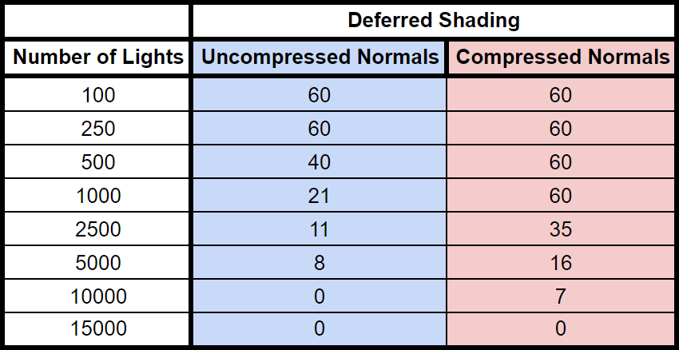

WebGL Clustered Deferred and Forward+ Shading
======================

**University of Pennsylvania, CIS 565: GPU Programming and Architecture, Project 5**

* Jonathan Lee
* Tested on: **Google Chrome 61.0.3163.100** on
  Windows 10, Xeon ES-1630 @ 3.70GHz 32GB, GTX 1070 24GB (SigLab)

# Overview

In this project, I was able to explore **Clustered Forward+ and Deferred Shading**. 

### Live Demo

# Clustering
Both of these implementations of Forward+ and Deferred Shading were done using clustering. All of the operations are computed in camera space and the camera frustum gets split into clusters. 

# Clustered Forward+

Forward+ is an extension of Forward Shading except we use the light's z position determines how to find the cluster it's in. Once we find the cluster that the light's in, the shader only computes for the lights that lie within the cluster.

# Clustered Deferred

Deferred Shading utilizes the same logic of dividing the camera frustum based on the light's position. The shading, however, requires two passes. Fragments get written the the g-buffer and store position, color, and normal values. 

### Blinn Shading

| 100 Shininess             | 200 Shininess              | 500 Shininess            | 
|---------------------------|----------------------------|--------------------------|
|   |    |  |  

| Without Blinn             | With Blinn                       | 
|---------------------------|----------------------------------|
|  |    |

# Analysis

## Forward vs. Forward+ vs. Deferred Shading

Clearly, Deferred Shading performs much better than Forward+ and Forward Shading. The divide between the clustered shaders and Foward begins rapidly around 200 lights. Deferred becomes nearly impossible to see at around 15000 lights.

## Normal Compression in Deferred Shading

To do compression, I stored `normal.x` and `normal.y` at the `w` position of the `vec4` that also stores position and color. Rather than reading in the value from a third g-buffer that only stores the normal, `normal.z` can be calculated in the shader. Surpsingly, I found a huge dropoff between uncompressed and compressed normals after 500 lights.

### Credits

* [Three.js](https://github.com/mrdoob/three.js) by [@mrdoob](https://github.com/mrdoob) and contributors
* [stats.js](https://github.com/mrdoob/stats.js) by [@mrdoob](https://github.com/mrdoob) and contributors
* [webgl-debug](https://github.com/KhronosGroup/WebGLDeveloperTools) by Khronos Group Inc.
* [glMatrix](https://github.com/toji/gl-matrix) by [@toji](https://github.com/toji) and contributors
* [minimal-gltf-loader](https://github.com/shrekshao/minimal-gltf-loader) by [@shrekshao](https://github.com/shrekshao)

### References
* [Blinn Shading](https://en.wikipedia.org/wiki/Blinn%E2%80%93Phong_shading_model) 
* [Various Camera Stuff](http://www.txutxi.com/)
* [OpenGL-Tutorail](http://www.opengl-tutorial.org)
* [Foward+ vs. Deferred](https://www.3dgep.com/forward-plus_)
* CIS560 and CIS565 Slides