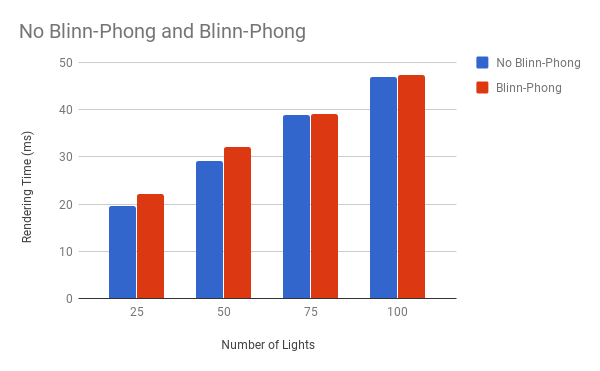
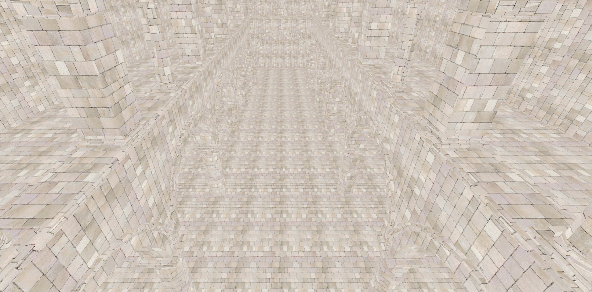

WebGL Clustered Deferred and Forward+ Shading
======================

**University of Pennsylvania, CIS 565: GPU Programming and Architecture, Project 5**

* Timothy Clancy
* Tested on: **Google Chrome 61.0.3163.100 (Official Build) (64-bit)** on
  Windows 10, i7-4700MQ @ 2.40GHz 8GB, GT 750M 2GB (Personal)

### A Note on this Analysis

This analysis was performed using a different machine than I normally develop with. Circumstances forced me to work with my old laptop, whose GT 750M might not have actually been working during these tests. The performance numbers measured here might have actually been from the on-board integrated graphics, although everything on my computer reported that they weren't. They just seem pretty low.

### The Shading Scene

In this project, a scene with some alterable number of lights is provided. The goal is to implement multiple shading approaches and compare their performance against one another.

|||||
|:-:|:-:|:-:|:-:|
|The scene with 25 lights.|The scene with 50 lights.|The scene with 75 lights.|The scene with 100 lights.|

### Live Online

### Demo GIF

||
|:-:|
|Deferred cluster shading with Blinn-Phong in action, 60 lights.|

### Clustered Forward+ Shading

In this feature, the camera's frustum is partitioned into cells and lights are clustered by their cells. The data structure representing groupings of lights and cells is, in this case, a texture buffer used to map the count of lights in a cell to a listing of identifying indices for those lights.

||||
|:-:|:-:|:-:|
|Partitioning in the x-dimension.|Partitioning in the y-dimension.|Partitioning in the z-dimension.|

Once partitioned as such, this structure allows an updated fragment shader to more efficiently compute lighting. Fragments to be lit need only have lighting calculations performed for lights in their specific clusters, instead of for every single light.

### Clustered Deferred Shading

### Optimization

### Performance Analysis

These benchmarks were taken with the scene's camera in the standard, starting position across a variable number of lights. They measure in milliseconds the average time across 10 seconds taken to render a particular frame. Blinn-Phong was disabled for the deferred clustering for these tests. These comparisons illustrate the performance changes seen when adding the new features.

  

### Blinn-Phong Shading

The deferred shader features additional Blinn-Phong specular highlighting. This is a flag which can be toggled like the other debug views in this implementation, and comes with a configurable value for the specular hardness of every surface. This gallery shows the effect of setting different specular hardness values on the scene.

|||||
|:-:|:-:|:-:|:-:|
|Specular hardness of 1.|Specular hardness of 50.|Specular hardness of 100.|Specular hardness of 1000.|

The addition of the Blinn-Phong feature did not have any noticeable performance impact. When compared across some variabled number of lights, the deferred cluster shader had very similar performance whether Blinn-Phong mode was enabled or not.

  

### Debugging Tools

In the course of implementing this shader comparison, I added some debug flags that can be toggled for the following displays.

||||
|:-:|:-:|:-:|
|Albedo debug.|Surface normal debug.|Ridiculous Blinn-Phong specular value.|

All of these flags are located in the deferred cluster fragment shader.

### Credits

* [Three.js](https://github.com/mrdoob/three.js) by [@mrdoob](https://github.com/mrdoob) and contributors
* [stats.js](https://github.com/mrdoob/stats.js) by [@mrdoob](https://github.com/mrdoob) and contributors
* [webgl-debug](https://github.com/KhronosGroup/WebGLDeveloperTools) by Khronos Group Inc.
* [glMatrix](https://github.com/toji/gl-matrix) by [@toji](https://github.com/toji) and contributors
* [minimal-gltf-loader](https://github.com/shrekshao/minimal-gltf-loader) by [@shrekshao](https://github.com/shrekshao)
