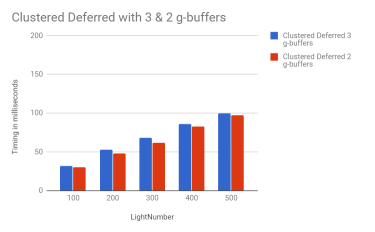

WebGL Clustered Deferred and Forward+ Shading
======================

**University of Pennsylvania, CIS 565: GPU Programming and Architecture, Project 5**

* LINSHEN XIAO
* Tested on: **Google Chrome 61.0.3163.100** on Windows 10, Intel(R) Core(TM) i7-6700HQ CPU @ 2.60GHz, 16.0GB, NVIDIA GeForce GTX 970M (Personal computer)

## Overview

In this project, I implemented 2 different rendering methods, including Clustered Forward+ and Clustered Deferred. For Clustered Forward+, I build a data structure to keep track of how many lights are in each cluster and what their indices are render the scene using only the lights that overlap a given cluster. For Clustered Deferred, I reuse clustering logic from Clustered Forward+ Store vertex attributes in g-buffer, read g-buffer in a shader to produce final output. Also, Blinn-Phong shading & Toon shading effects and simple optimization by reduce the number of g-buffers are implemented.

## Features

* Clustered Forward+
	* Slice the frustrum into 15 * 15 * 15 clusters, save the lights for each clusters and render the scene using only the lights that overlap the given cluster.
	* Most difficult part of this is to define if one light is in a cluster or not. Instead of check every light's position for each cluster, a better way is to judge the distance of light position to the plane for x, y & z, to find the smallest and largest index cluster for each dimension that the distance between it and the light position is smaller than light radius, and define all these cluster overlapped by the light. For z, it is simple because you can just consider the distance of light position's z coordinate to the z coordinate of each cluster. For x and y, we just need to find the distance from the point to the line on 2D plane, which is a dot product of the light position's xz or yz coordinate to the normal of the zy or xz plane.
* Clustered Deferred
	* Store attributes (normal, position, color) in g-buffer, read g-buffer in a shader to produce final output.
* Effects
	* Blinn-Phong shading (diffuse + specular);
	* Toon shading implemented;
* Optimizations
	* Optimized g-buffer format - reduce the number of g-buffers: I pack color, position and normal together into 2 vec4s: gbuffers[0]: [col.x, col.y, col.z, normal.x], gbuffers[1]: [pos.x, pos.y, pos.z, normal.y](Use 2-component normals, normal is in view space). We can reconstruct normal in view space and transform it back to world space by * u_invViewMatrix. However, the reconstructed normal may not be accurate enough.

## Results

### Live Online

[https://githublsx.github.io/Project5-WebGL-Clustered-Deferred-Forward-Plus](https://githublsx.github.io/Project5-WebGL-Clustered-Deferred-Forward-Plus/)

### Demo Video/GIF

### Effects:

#### Blinn-Phong shading:

#### Toon Shading:

### Bebug:

| Aldeo | Normal |
|-------------|--------------------------------|
|||

| Position | Depth |
|-------------|--------------------------------|
|||

## Performance Analysis

### Comparision of Forward, Clustered Forward+ & Clustered Deferred

| LightNumber | Forward | Clustered Forward+ | Clustered Deferred |
|-------------|---------|--------------------|--------------------|
| 100         | 105     | 42                 | 32                 |
| 200         | 182     | 77                 | 53                 |
| 300         | 303     | 133                | 68                 |
| 400         | 370     | 167                | 86                 |
| 500         | 476     | 250                | 100                |

(Timing in milliseconds)

As the number of light increase, it take longer time to render. We can also clearly tell that Clustered Deffered > Clustered Forward+ > Forward on efficiency. Instead of testing each fragment for every light in the scene in Forward, Clustered Forward+ divide frustrum into clusters and for each fragment, decide which cluster it's in and then only computed the final color with the light inside cluster, which greatly accerlate the process.

### Clustered Deferred with 3 & 2 g-buffers

| LightNumber | Clustered Deferred 3 g-buffers | Clustered Deferred 2 g-buffers |
|-------------|--------------------------------|--------------------------------|
| 100         | 32                             | 30                             |
| 200         | 53                             | 48                             |
| 300         | 68                             | 62                             |
| 400         | 86                             | 83                             |
| 500         | 100                            | 97                             |

We can see that the difference with Clustered Deferred with 3 or 2 g-buffers is not very obvious. This is because though the number of the g-buffers is reduced, Clustered Deferred with 2 g-buffers needs extra time to reconstruct the normal.

### Credits

* [Three.js](https://github.com/mrdoob/three.js) by [@mrdoob](https://github.com/mrdoob) and contributors
* [stats.js](https://github.com/mrdoob/stats.js) by [@mrdoob](https://github.com/mrdoob) and contributors
* [webgl-debug](https://github.com/KhronosGroup/WebGLDeveloperTools) by Khronos Group Inc.
* [glMatrix](https://github.com/toji/gl-matrix) by [@toji](https://github.com/toji) and contributors
* [minimal-gltf-loader](https://github.com/shrekshao/minimal-gltf-loader) by [@shrekshao](https://github.com/shrekshao)
