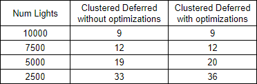

WebGL Clustered Deferred and Forward+ Shading
======================

**University of Pennsylvania, CIS 565: GPU Programming and Architecture, Project 5**

* Aman Sachan
* Tested on: Windows 10, Intel(R) Xeon(R) CPU E5-1630 v4 @ 3.7GHz (8 CPUs) 32GB RAM, 
			GTX 1070 8081MB (Lab Machine)

## Live Online

## Demo Video/GIF

## OverView
//2050 lights at 60 FPS
## Features

### Forward Shading Model

### Clustered Forward+ Shading Model

### Clustered Deferred Shading Model

### Clustering

### Optimizations

#### Using Two G-buffers (use total 8 channels) - Pack values together into vec4s
#### 2 Component Normals

### Effects
#### Toon Shading
#### Blinn-Phong

## Debug Views

## Credits

* [Three.js](https://github.com/mrdoob/three.js) by [@mrdoob](https://github.com/mrdoob) and contributors
* [stats.js](https://github.com/mrdoob/stats.js) by [@mrdoob](https://github.com/mrdoob) and contributors
* [webgl-debug](https://github.com/KhronosGroup/WebGLDeveloperTools) by Khronos Group Inc.
* [glMatrix](https://github.com/toji/gl-matrix) by [@toji](https://github.com/toji) and contributors
* [minimal-gltf-loader](https://github.com/shrekshao/minimal-gltf-loader) by [@shrekshao](https://github.com/shrekshao)
