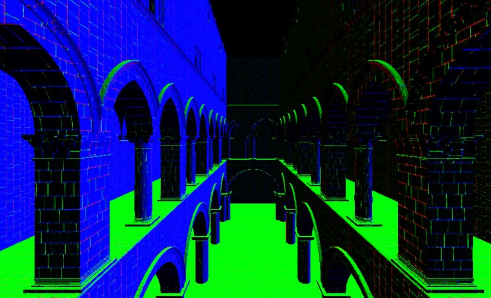

WebGL Clustered Deferred and Forward+ Shading
=============================================

**University of Pennsylvania, CIS 565: GPU Programming and Architecture, Project 5**

* Yash Vardhan
* Tested on: Windows 10 Pro, Intel i5-4200U (4) @ 2.600GHz 4GB, NVIDIA GeForce 840M 2048MB

In this project, I have implemented Clustered Forward+ shading and Clustered Deferred shading and added Blinn-Phong shading effect.

Checkout this [live demo](https://yashv28.github.io/Project5-WebGL-Clustered-Deferred-Forward-Plus/)

# Features:

### Effects:
* Deferred Blinn-Phong shading (diffuse + specular) for point lights.

### Optimizations:
* Optimized g-buffer format - reduces the number and size of g-buffers: 
  - Used 2-component normals
  - Reduced number of properties passed via g-buffer by reconstructing world space position using camera matrices and X/Y/depth

# Performance Analysis:

All analysis done on 1366x768 with default cluster size of 15x15x15.

### Bloopers

Different views to check correctness:

|  Albedo | Normal |
| ----------- | ----------- |
|  |  |

| Depth | Z-Slices |
| ----------- | ----------- |
|  |  |

### Credits

* [Three.js](https://github.com/mrdoob/three.js) by [@mrdoob](https://github.com/mrdoob) and contributors
* [stats.js](https://github.com/mrdoob/stats.js) by [@mrdoob](https://github.com/mrdoob) and contributors
* [webgl-debug](https://github.com/KhronosGroup/WebGLDeveloperTools) by Khronos Group Inc.
* [glMatrix](https://github.com/toji/gl-matrix) by [@toji](https://github.com/toji) and contributors
* [minimal-gltf-loader](https://github.com/shrekshao/minimal-gltf-loader) by [@shrekshao](https://github.com/shrekshao)
