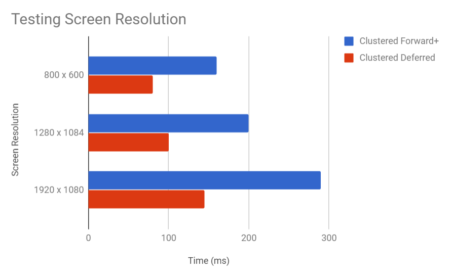

WebGL Clustered Deferred and Forward+ Shading
======================

**University of Pennsylvania, CIS 565: GPU Programming and Architecture, Project 5**

* Ricky Rajani
* Tested on: **Google Chrome 62.0.3202** on
  Windows 10, i5-6200U @ 2.30GHz, Intel(R) HD Graphics 520 4173MB (Personal Computer)

This project implements Clustered Deferred and Forward+ Shading using WebGL.

### Live Online

- Num of Lights: 1500
- Light Radius: 3.0

### Demo Video/GIF

### Features
- Clustered Forward+
- Clustered Deferred
- Blinn-Phong shading
- Optimizations of g-buffers

This project has implementations for three rendering methods for performance comparison reasons.
- Forward shading: Loop over all the lights in the scene for each geometry.
- Clustered shading: Divide the camera frustrum into 16 x 16 x 16 clusters. For shading, each cluster is assigned lights that affect the cluster. This provides for better worse case performance with large depth discontinuities.
- Forward+ shading: Forward shading with light culling for screen-space tiles.
- Deferred shading: Consists of two passes: G-buffer pass and lighting pass. All the shading occurs during the lighting pass using clustered shading. The primary advantage of deferred shading is the decoupling of scene geometry from lighting. Only one geometry pass is required and each light is only computed for those pixels that it actually affects. This gives the ability to render many lights in a scene without a significant performance-hit.

### Performance Analysis

Testing number of lights
  - Light's radius	: 3.0
  - Resolution	: 1920 x 1080
  - Cluster Dimension : 16 x 16 x 16
  

Deferred shading is better for large number of lights. Deferred shading grabs its shading informationg from the closest fragment (from g-buffers), it is faster than Forward+. This advantage comes from deferred only having to shade one fragment per pixel rather than all the fragments associated to each pixel.

While forward plus takes more time to do light calculation of geometry vertices that do not contribute to final rendering result, clustered deferred shading avoids the problem by first pass.

Testing resolution
  - Number of Lights : 1000 
  - Light's radius	: 3.0
  - Cluster Dimension : 16 x 16 x 16

Deferred shading's performance depends more on screen resolution than scene complexity. Here you can see that its efficiency increases as the resolution increases in a scene with 1000 lights.

  
Optimized g-buffer format:
  - Used two rather than four g-buffers
    - Use 2-component normals
    - Reduce number of properties passed via g-buffer by reconstructing world space position
  []
  
There isn't a significant improvement in performance when reducing the number of g-buffers used. The time it takes to grab the appropriate texels from the g-buffers is similar to the time of reconstructing world space position. However, there is clearly an improvement in memory allocation due to a decrease in the amount of g-buffers used. 

### Credits

* [Three.js](https://github.com/mrdoob/three.js) by [@mrdoob](https://github.com/mrdoob) and contributors
* [stats.js](https://github.com/mrdoob/stats.js) by [@mrdoob](https://github.com/mrdoob) and contributors
* [webgl-debug](https://github.com/KhronosGroup/WebGLDeveloperTools) by Khronos Group Inc.
* [glMatrix](https://github.com/toji/gl-matrix) by [@toji](https://github.com/toji) and contributors
* [minimal-gltf-loader](https://github.com/shrekshao/minimal-gltf-loader) by [@shrekshao](https://github.com/shrekshao)
