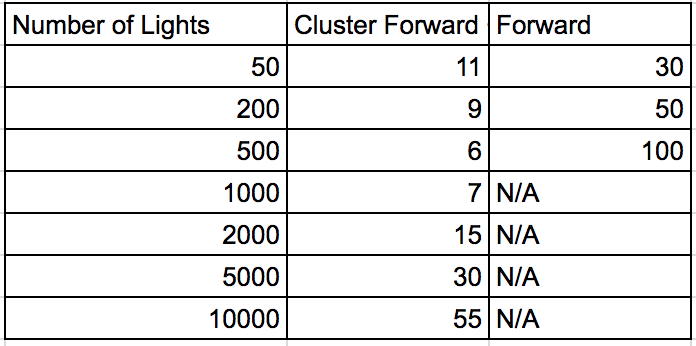

WebGL Clustered Deferred and Forward+ Shading
======================

**University of Pennsylvania, CIS 565: GPU Programming and Architecture, Project 5**

* (TODO) YOUR NAME HERE
* Tested on: (TODO) **Google Chrome 222.2** on
  Windows 22, i7-2222 @ 2.22GHz 22GB, GTX 222 222MB (Moore 2222 Lab)

### Live Online

### Overview

This project consists of implementations of a **Clustered Forward+** renderer and a **Clustered Deferred** renderer, compared against a general case **Forward** renderer. 

A forward renderer performs brute force lighting by shading fragments against every possible light in the scene. The unnecessary work is in the negligible effects a given light has on the majority of fragments. A solution to this is to divide our rendered area up into "clusters", where the fragments in a given cluster need only be shaded for the lights that affect that specific cluster. This involves a CPU side preprocessing of light information to map clusters to their relevant lights. This is what **Clustered Forward+** performs.

To further decrease the amount of unnecessary work done, a further solution is to defer lighting to a second stage after fragment attributes have been computed. On a first pass, the scene is processed and attributes are passed to a g-buffer, which is then passed to a second pass render (in which we can again use our clustering technique). We are able to leverage the fact that the first render pass discards all unnecessary fragments (such as those occluded). This is what **Clustered Deferred** performs.

### Comparisons of Implementation

| Forward Renderer | Clustered Forward+ | Clustered Deferred  (w/ Blinn-Phong)|
|:----:|:----:|:----:|
|  |  |  |

### Analysis

### Debug Views

### Credits

* [Three.js](https://github.com/mrdoob/three.js) by [@mrdoob](https://github.com/mrdoob) and contributors
* [stats.js](https://github.com/mrdoob/stats.js) by [@mrdoob](https://github.com/mrdoob) and contributors
* [webgl-debug](https://github.com/KhronosGroup/WebGLDeveloperTools) by Khronos Group Inc.
* [glMatrix](https://github.com/toji/gl-matrix) by [@toji](https://github.com/toji) and contributors
* [minimal-gltf-loader](https://github.com/shrekshao/minimal-gltf-loader) by [@shrekshao](https://github.com/shrekshao)
* [Practical Clustered Shading](http://www.humus.name/Articles/PracticalClusteredShading.pdf) by Emil Persson, Head of Research, Avalanche Studios
